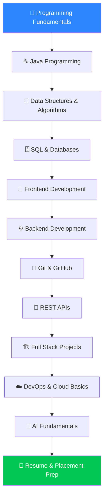
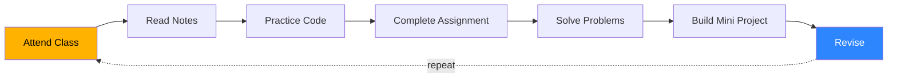

<div align="center">

# 🚀 Ready2Learn Learning Hub

### Learn. Build. Get Placed.


[](#)
[](#)
[](#)
[](#)

</div>

---

## 📌 About

**Ready2Learn** is a mentorship-driven repository that takes you from **absolute beginner** to **placement-ready software engineer** — with structured notes, hands-on code, real projects, and continuous support.

> 🎯 *"We don't just teach programming — we mentor you into a career."*

---

## 🗺️ Your Learning Journey



---

## 📂 Repository Structure

<details>
<summary><b>📁 Click to expand full folder structure</b></summary>

```
00-Getting-Started
01-Programming-Fundamentals
02-Java
03-DSA
04-SQL
05-HTML
06-CSS
07-JavaScript
08-React
09-SpringBoot
10-NodeJS
11-Git-GitHub
12-REST-API
13-Full-Stack-Projects
14-DevOps
15-Cloud
16-AI-Fundamentals
17-Resume
18-LinkedIn
19-Interview-Preparation
```

</details>

---

## 📖 What's Inside Every Module

| 📘 Notes | 💻 Code Examples | 📝 Assignments | 🎯 Practice Problems | 🛠 Mini Projects | 📂 References |
|:---:|:---:|:---:|:---:|:---:|:---:|

---

## 🎓 The Learning Loop



> 💡 **Consistency beats speed.** Small daily progress compounds into big results.

---

## ✅ Learning Rules

- 🚫 Don't skip topics
- ⏱️ Practice daily, even 30 minutes
- ✍️ Write code yourself — don't copy
- ❓ Ask questions when stuck
- 🧠 Understand, don't memorize
- 🪜 Master one concept before the next

---

## 🛠️ Before Every Coding Session — Ask Yourself

<details>
<summary><b>Click to reveal the checklist ✔️</b></summary>

- Do I understand the problem?
- Can I solve it without looking at the answer?
- Can I explain my solution to a friend?
- What did I learn today?

If you can answer all four — **you're making real progress.** 🚀

</details>

---

## 📅 Weekly Goal Tracker

- [ ] All class notes reviewed
- [ ] Assignments completed
- [ ] Coding practice done
- [ ] Mini project built (if assigned)
- [ ] Topics revised

---

## 🤝 Need Help?

1. Read the notes again 📖
2. Review class examples 💻
3. Try solving it yourself 🧩
4. Ask your doubt in the community 🙋

> **There are no silly questions. Every expert was once a beginner.** 💙

---

## 🌟 Our Promise

<div align="center">

| 💪 Skill Building | 🏗️ Real Projects | 🎯 Internship Prep | 🚀 Placement Ready |
|:---:|:---:|:---:|:---:|

</div>

You're not learning alone — you're part of the **Ready2Learn community**. 🤝

---

## ❤️ Final Message

Learning to code can feel hard at first — and that's completely normal.

**Don't compare yourself with others.**
**Compare yourself with who you were yesterday.**

Keep learning. Keep building. Keep improving. 💙

---

<div align="center">

### 🚀 Welcome to Ready2Learn
**Learn. Build. Get Placed.**

Happy Learning! 💙


</div>
