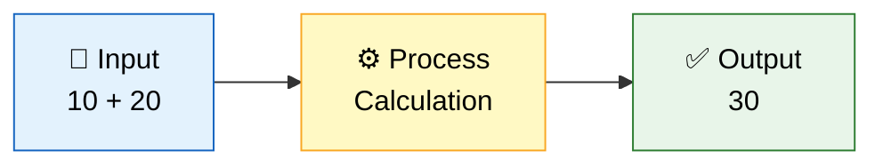
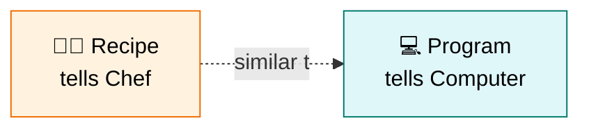
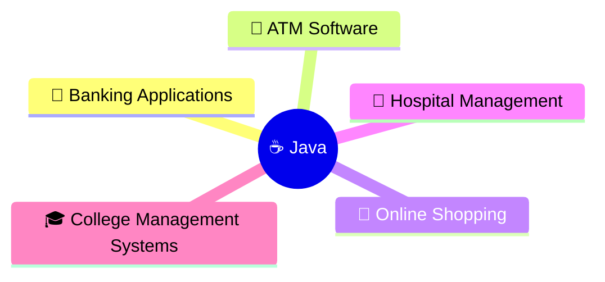
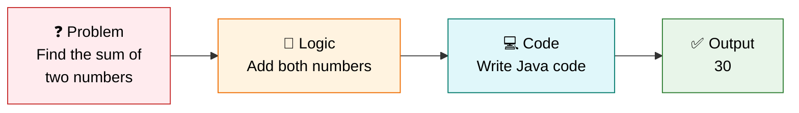
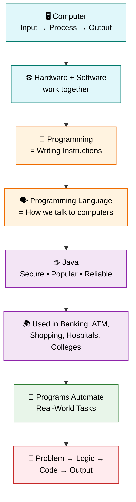

# 🚀 Level 1 — Introduction to Programming
### *Your First Step Into the World of Code*

---

## 🎯 Goal of This Level

> 💬 **Understand what programming is — *before* writing any code.**

No code. No pressure. Just clear concepts, one step at a time. 🌱

---

## 🗺️ Your Learning Path

```mermaid
flowchart LR
    A["🖥️ 1. What is a<br/>Computer?"] --> B["⚙️ 2. Hardware<br/>vs Software"]
    B --> C["📝 3. What is<br/>Programming?"]
    C --> D["🗣️ 4. Programming<br/>Language"]
    D --> E["☕ 5. Why Java?"]
    E --> F["🌍 6. Where Java<br/>is Used?"]
    F --> G["🤖 7. Programs Solve<br/>Real Problems"]
    G --> H["🔁 8. Problem → Logic<br/>→ Code → Output"]
    H --> I["🏁 Level 1<br/>Summary"]

    style A fill:#e0f7fa,stroke:#00796b,color:#000
    style B fill:#e0f7fa,stroke:#00796b,color:#000
    style C fill:#fff3e0,stroke:#ef6c00,color:#000
    style D fill:#fff3e0,stroke:#ef6c00,color:#000
    style E fill:#f3e5f5,stroke:#8e24aa,color:#000
    style F fill:#f3e5f5,stroke:#8e24aa,color:#000
    style G fill:#e8f5e9,stroke:#2e7d32,color:#000
    style H fill:#e8f5e9,stroke:#2e7d32,color:#000
    style I fill:#ffebee,stroke:#c62828,color:#000
```

---

## ✅ Progress Tracker

Use this checklist as you move through the guide — tick each box as you finish a section!

- [ ] 1. What is a Computer?
- [ ] 2. Hardware vs Software
- [ ] 3. What is Programming?
- [ ] 4. What is a Programming Language?
- [ ] 5. Why Java?
- [ ] 6. Where Java is Used?
- [ ] 7. How Programs Solve Real-World Problems
- [ ] 8. Problem → Logic → Code → Output
- [ ] 📝 Level 1 Summary

---
---

# 1️⃣ What is a Computer?

<blockquote>

### 📖 Simple Definition
A **computer** is an electronic device that accepts input, processes it, stores data, and produces output.

</blockquote>

### 💡 Suitable Example

> You type a calculation in the Calculator app:

| Step | Action | Value |
|:---:|:---|:---:|
| 🔢 **Input** | The numbers you enter | `10 + 20` |
| ⚙️ **Process** | Computer calculates | — |
| ✅ **Output** | The result shown | `30` |

🇮🇳 <b>படிக்க கிளிக் செய்யவும் — Simple Tamil Explanation</b>

 

**Computer** என்பது நாம் கொடுக்கும் தகவலை (**Input**) வாங்கி, அதை செயல்படுத்தி (**Process**), முடிவை (**Output**) காட்டும் ஒரு மின்னணு சாதனம்.

> [!TIP]
> ### ⭐ Key Points to Remember
> - Computer takes **Input**.
> - Computer processes the data.
> - Computer gives **Output**.
> - Computer works very fast and accurately.

[⬆️ Back to Learning Path](#️-your-learning-path)

---

# 2️⃣ Hardware vs Software

<blockquote>

### 📖 Simple Definition
- **Hardware** is the physical part of a computer.
- **Software** is the program or application that runs on the computer.

</blockquote>

### 💡 Suitable Example

| 📱 Component | Type | Role |
|:---|:---:|:---|
| **Phone** | 🔩 Hardware | The physical device |
| **WhatsApp** | 💾 Software | The application running on it |

🇮🇳 <b>படிக்க கிளிக் செய்யவும் — Simple Tamil Explanation</b>

 

**Hardware** என்பது கணினியில் நாம் கையால் தொடக்கூடிய பகுதிகள்.

**Software** என்பது அந்த Hardware-ல் இயங்கும் Program அல்லது Application.

> [!TIP]
> ### ⭐ Key Points to Remember
> - Hardware = Physical Parts
> - Software = Programs
> - Hardware cannot work without Software.
> - Software cannot run without Hardware.

> [!NOTE]
> ### 🤝 Remember This Relationship
> Hardware and Software **depend on each other** — one is useless without the other!

[⬆️ Back to Learning Path](#️-your-learning-path)

---

# 3️⃣ What is Programming?

<blockquote>

### 📖 Simple Definition
Programming is the process of writing instructions that tell a computer what to do.

</blockquote>

### 💡 Suitable Example

> 🍳 A recipe tells a chef how to cook.
> Similarly, a program tells a computer how to perform a task.

🇮🇳 <b>படிக்க கிளிக் செய்யவும் — Simple Tamil Explanation</b>

 

**Programming** என்றால், **கணினிக்கு என்ன செய்ய வேண்டும் என்று கட்டளைகள் (Instructions) எழுதுவது**.

நாம் சொல்லும் Instructions-ஐ கணினி அப்படியே செய்து காட்டும்.

> [!TIP]
> ### ⭐ Key Points to Remember
> - Programming = Giving instructions.
> - Computer only follows instructions.
> - No instructions = No work.

> [!WARNING]
> ### ⚠️ Common Misunderstanding
> A computer **cannot think on its own** — it strictly follows the instructions you give it. No instructions means no action!

[⬆️ Back to Learning Path](#️-your-learning-path)

---

# 4️⃣ What is a Programming Language?

<blockquote>

### 📖 Simple Definition
A programming language is a language used to communicate with a computer.

</blockquote>

### 💡 Suitable Example

| 🗣️ Communication With | Language Used |
|:---|:---|
| **People** | English, Tamil |
| **Computers** | Java, Python, C |

🇮🇳 <b>படிக்க கிளிக் செய்யவும் — Simple Tamil Explanation</b>

 

நாம் மனிதர்களுடன் பேச English அல்லது Tamil பயன்படுத்துகிறோம்.

அதேபோல், கணினியுடன் பேச Java, Python, C போன்ற Programming Languages பயன்படுத்தப்படுகின்றன.

> [!TIP]
> ### ⭐ Key Points to Remember
> - Programming Language helps us communicate with computers.
> - Different programming languages are available.
> - Java is one of them.

[⬆️ Back to Learning Path](#️-your-learning-path)

---

# 5️⃣ Why Java? ☕

<blockquote>

### 📖 Simple Definition
Java is one of the most popular programming languages used to build secure and reliable applications.

</blockquote>

### 💡 Suitable Example

> 🏦 Many banking and shopping applications use Java because it is **secure** and **stable**.

🇮🇳 <b>படிக்க கிளிக் செய்யவும் — Simple Tamil Explanation</b>

 

**Java** என்பது உலகம் முழுவதும் அதிகமாக பயன்படுத்தப்படும் Programming Language.

பெரிய நிறுவனங்கள் பாதுகாப்பான Applications உருவாக்க Java-வை பயன்படுத்துகின்றன.

> [!TIP]
> ### ⭐ Key Points to Remember

| ✅ Feature | 📌 Why It Matters |
|:---|:---|
| 🎓 Easy to learn | Great for beginners |
| 🔒 Secure | Trusted for sensitive applications |
| 🌍 Platform Independent | Runs anywhere |
| 🏭 Widely used in industries | High demand skill |

[⬆️ Back to Learning Path](#️-your-learning-path)

---

# 6️⃣ Where Java is Used? 🌍

<blockquote>

### 📖 Simple Definition
Java is used to develop many real-world applications.

</blockquote>

### 💡 Suitable Example

🇮🇳 <b>படிக்க கிளிக் செய்யவும் — Simple Tamil Explanation</b>

 

நாம் தினமும் பயன்படுத்தும் பல Applications-ன் Backend-ல் Java பயன்படுத்தப்படுகிறது.

உதாரணம்:
- ATM
- Banking Apps
- Shopping Websites
- Hospital Software

> [!TIP]
> ### ⭐ Key Points to Remember
> - 🏦 Banking
> - 🛒 E-Commerce
> - 🏢 Enterprise Applications
> - 🖥️ Backend Development
> - 📱 Android (Older Versions)

[⬆️ Back to Learning Path](#️-your-learning-path)

---

# 7️⃣ How Programs Solve Real-World Problems 🤖

<blockquote>

### 📖 Simple Definition
Programs solve problems by automating tasks.

</blockquote>

### 💡 Suitable Example

| Scenario | Method | Result |
|:---|:---|:---|
| ❌ **Without a calculator** | You calculate manually | Slow, error-prone |
| ✅ **With a calculator** | Enter numbers → Get answer instantly | Fast, accurate |

🇮🇳 <b>படிக்க கிளிக் செய்யவும் — Simple Tamil Explanation</b>

 

முன்பு மனிதர்கள் கையால் செய்த வேலைகளை, இன்று Programs சில நொடிகளில் செய்து முடிக்கின்றன.

அதனால் நேரமும் உழைப்பும் குறைகிறது.

> [!TIP]
> ### ⭐ Key Points to Remember
> - ⏱️ Programs save time.
> - 💪 Programs reduce manual work.
> - 🌍 Programs solve real-world problems.

[⬆️ Back to Learning Path](#️-your-learning-path)

---

# 8️⃣ Problem → Logic → Code → Output 🔁

<blockquote>

### 📖 Simple Definition
Every program follows a simple process:
First identify the problem, think of a solution, write code, and get the output.

</blockquote>

### 💡 Suitable Example

🇮🇳 <b>படிக்க கிளிக் செய்யவும் — Simple Tamil Explanation</b>

 

எந்த Program-ஆ இருந்தாலும் இந்த Flow-ஐ பின்பற்றும்.

**Problem → எப்படி தீர்ப்பது என்று யோசி (Logic) → Code எழுது → Output பெறு**

> [!TIP]
> ### ⭐ Key Points to Remember
> - Every program starts with a **problem**.
> - **Logic** comes before coding.
> - **Code** follows the logic.
> - **Output** is the final result.

[⬆️ Back to Learning Path](#️-your-learning-path)

---
---

# 📝 Level 1 Summary

### 🏁 You made it to the end — great work!

## 📖 What You Learned

<b>📚 Click to expand / collapse the full topic list</b>

 

1. ✅ What is a Computer?
2. ✅ Hardware vs Software
3. ✅ What is Programming?
4. ✅ What is a Programming Language?
5. ✅ Why Java?
6. ✅ Where Java is Used?
7. ✅ How Programs Solve Problems
8. ✅ Problem → Logic → Code → Output

---

## ⭐ Final Key Points to Remember

> [!IMPORTANT]
>
> | # | Concept | Key Idea |
> |:---:|:---|:---|
> | 1️⃣ | **Computer** | Input → Process → Output |
> | 2️⃣ | **Hardware** | Physical Parts |
> | 3️⃣ | **Software** | Programs |
> | 4️⃣ | **Programming** | Writing Instructions |
> | 5️⃣ | **Programming Language** | Language to communicate with computers |
> | 6️⃣ | **Java** | Popular, Secure, Industry Standard Language |
> | 7️⃣ | **Programs** | Solve real-world problems |
> | 8️⃣ | **Golden Flow** | **Problem → Logic → Code → Output** |

---

## 🔁 Quick Revision — The Big Picture

---

> 🎉 **Congratulations!** You've completed **Level 1 — Introduction to Programming**.
>
> You now understand *what* programming is, before writing a single line of code.
>
> ### ➡️ Ready for **Level 2**? Keep the momentum going!

---

**📌 Level 1 · Introduction to Programming · Beginner Track**

