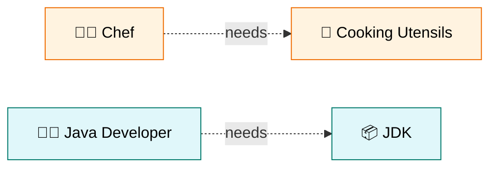
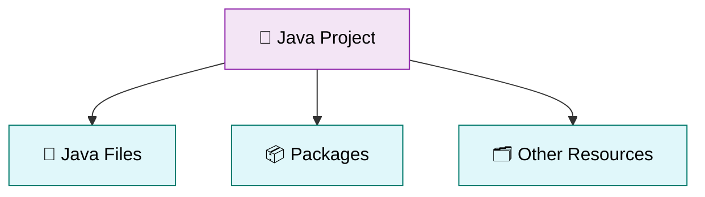
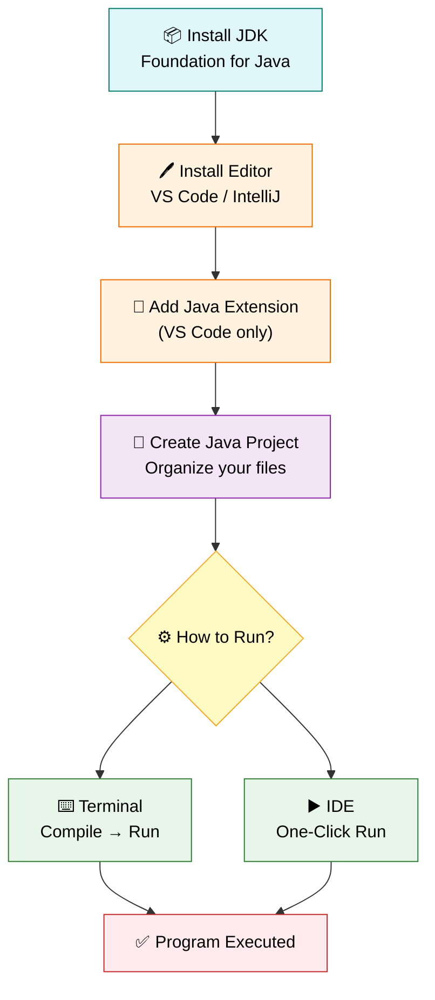

# ⚙️ Level 2 — Java Environment Setup
### *Get Your Machine Ready to Code*

---

## 🎯 Goal of This Level

> 💬 **Prepare your computer for Java development and run your first Java program.**

By the end of this level, your machine will be fully ready to write, compile, and run Java code. 🛠️

---

## 🗺️ Your Setup Journey

```mermaid
flowchart LR
    A["📦 1. Install<br/>JDK"] --> B["🖊️ 2. Install<br/>VS Code / IntelliJ"]
    B --> C["🧩 3. Install<br/>Java Extension"]
    C --> D["📁 4. Create First<br/>Java Project"]
    D --> E["⌨️ 5. Run Java via<br/>Terminal"]
    E --> F["▶️ 6. Run Java<br/>via IDE"]
    F --> G["🏁 Level 2<br/>Summary"]

    style A fill:#e0f7fa,stroke:#00796b,color:#000
    style B fill:#fff3e0,stroke:#ef6c00,color:#000
    style C fill:#fff3e0,stroke:#ef6c00,color:#000
    style D fill:#f3e5f5,stroke:#8e24aa,color:#000
    style E fill:#e8f5e9,stroke:#2e7d32,color:#000
    style F fill:#e8f5e9,stroke:#2e7d32,color:#000
    style G fill:#ffebee,stroke:#c62828,color:#000
```

---

## ✅ Progress Tracker

Tick each box as you complete a step of your setup!

- [ ] 1. Install JDK (Java Development Kit)
- [ ] 2. Install VS Code / IntelliJ IDEA
- [ ] 3. Install Java Extension
- [ ] 4. Create Your First Java Project
- [ ] 5. Run Java Using Terminal
- [ ] 6. Run Java Using IDE
- [ ] 📝 Level 2 Summary

---
---

# 1️⃣ Install JDK (Java Development Kit) 📦

<blockquote>

### 📖 Simple Definition
JDK (Java Development Kit) is a software package that helps us write, compile, and run Java programs.

</blockquote>

### 💡 Suitable Example

> 👨‍🍳 Just like a **chef needs cooking utensils** to prepare food, a Java developer needs the **JDK** to create Java programs.

🇮🇳 <b>படிக்க கிளிக் செய்யவும் — Simple Tamil Explanation</b>

 

**JDK** என்பது Java Program எழுதவும், Compile செய்யவும், Run செய்யவும் தேவையான Software Package.

Java Program எழுத வேண்டுமென்றால் முதலில் JDK Install செய்ய வேண்டும்.

> [!TIP]
> ### ⭐ Key Points to Remember
> - JDK = Java Development Kit
> - Required to develop Java programs
> - Without JDK, Java programs cannot run

[⬆️ Back to Setup Journey](#️-your-setup-journey)

---

# 2️⃣ Install VS Code / IntelliJ IDEA 🖊️

<blockquote>

### 📖 Simple Definition
VS Code and IntelliJ IDEA are IDEs (Editors) used to write Java code easily.

</blockquote>

### 💡 Suitable Example

> 📝 Just like **Microsoft Word** is used to type documents, **VS Code or IntelliJ** is used to write Java programs.

| 🖊️ Tool | Description |
|:---|:---|
| **VS Code** | Lightweight code editor |
| **IntelliJ IDEA** | Powerful and widely used IDE |

🇮🇳 <b>படிக்க கிளிக் செய்யவும் — Simple Tamil Explanation</b>

 

**VS Code** மற்றும் **IntelliJ IDEA** என்பது Java Code எழுத உதவும் Software.

இவை Code எழுதவும், Run செய்யவும், Errors கண்டுபிடிக்கவும் உதவுகின்றன.

> [!TIP]
> ### ⭐ Key Points to Remember
> - IDE = Software for writing code
> - VS Code is lightweight
> - IntelliJ IDEA is powerful and widely used

[⬆️ Back to Setup Journey](#️-your-setup-journey)

---

# 3️⃣ Install Java Extension 🧩

<blockquote>

### 📖 Simple Definition
Java Extension adds Java support to VS Code.

</blockquote>

### 💡 Suitable Example

> 📱 Installing Java Extension is like **adding a new feature to your mobile app**.

🇮🇳 <b>படிக்க கிளிக் செய்யவும் — Simple Tamil Explanation</b>

 

VS Code-ல் Java எழுத வேண்டுமெனில் **Java Extension** Install செய்ய வேண்டும்.

இது Java Code-ஐ Run செய்யவும், Errors காட்டவும் உதவுகிறது.

> [!TIP]
> ### ⭐ Key Points to Remember
> - Required only for VS Code
> - Enables Java coding features
> - Makes coding easier

> [!NOTE]
> ### 💻 Editor Choice
> If you use **IntelliJ IDEA**, Java support is already **built-in** — the extension step applies only to **VS Code** users.

[⬆️ Back to Setup Journey](#️-your-setup-journey)

---

# 4️⃣ Create Your First Java Project 📁

<blockquote>

### 📖 Simple Definition
A Java project is a folder that contains Java files and related resources.

</blockquote>

### 💡 Suitable Example

> 📓 Just like a **notebook stores all your subject notes**, a project stores all your Java files.

🇮🇳 <b>படிக்க கிளிக் செய்யவும் — Simple Tamil Explanation</b>

 

**Java Project** என்பது Java Program-களை ஒரே இடத்தில் வைத்திருக்கும் Folder.

அதில் Java Files, Packages மற்றும் பிற தேவையான Files இருக்கும்.

> [!TIP]
> ### ⭐ Key Points to Remember
> - Project = Collection of Java files
> - Helps organize code
> - Easy to manage applications

[⬆️ Back to Setup Journey](#️-your-setup-journey)

---

# 5️⃣ Run Java Using Terminal ⌨️

<blockquote>

### 📖 Simple Definition
The Terminal is a command-line tool used to compile and run Java programs.

</blockquote>

### 💡 Suitable Example

> ⌨️ Instead of **clicking buttons**, you **type commands** to tell the computer what to do.

🇮🇳 <b>படிக்க கிளிக் செய்யவும் — Simple Tamil Explanation</b>

 

**Terminal** என்பது Commands கொடுத்து Program-ஐ Run செய்ய பயன்படும் Tool.

இதில் Java Commands-ஐ Type செய்து Program-ஐ Execute செய்யலாம்.

> [!TIP]
> ### ⭐ Key Points to Remember
> - Uses commands
> - Compile first
> - Run next

[⬆️ Back to Setup Journey](#️-your-setup-journey)

---

# 6️⃣ Run Java Using IDE ▶️

<blockquote>

### 📖 Simple Definition
An IDE allows you to run Java programs with a single click.

</blockquote>

### 💡 Suitable Example

> ▶️ Instead of typing commands manually, you simply click the **Run ▶️** button.

🇮🇳 <b>படிக்க கிளிக் செய்யவும் — Simple Tamil Explanation</b>

 

IDE-யில் Java Program-ஐ Run செய்ய Commands தேவையில்லை.

**Run Button**-ஐ Click செய்தால் Program Execute ஆகும்.

> [!TIP]
> ### ⭐ Key Points to Remember
> - Easy for beginners
> - One-click execution
> - Faster development

[⬆️ Back to Setup Journey](#️-your-setup-journey)

---

## 🔍 Quick Comparison — Terminal vs IDE

| ⚔️ Aspect | ⌨️ Terminal | ▶️ IDE |
|:---|:---|:---|
| **Method** | Type commands | Click Run button |
| **Steps** | Compile → Run | Single click |
| **Best for** | Understanding the process | Speed and convenience |

---
---

# 📝 Level 2 Summary

### 🏁 Your environment is ready — great work!

## 📖 What You Learned

<b>📚 Click to expand / collapse the full topic list</b>

 

1. ✅ Install JDK
2. ✅ Install VS Code / IntelliJ IDEA
3. ✅ Install Java Extension
4. ✅ Create a Java Project
5. ✅ Run Java using Terminal
6. ✅ Run Java using IDE

---

## ⭐ Final Key Points to Remember

> [!IMPORTANT]
>
> | # | Concept | Key Idea |
> |:---:|:---|:---|
> | 1️⃣ | **JDK** | Required to develop Java programs |
> | 2️⃣ | **VS Code / IntelliJ** | Used to write Java code |
> | 3️⃣ | **Java Extension** | Enables Java support in VS Code |
> | 4️⃣ | **Project** | Organizes Java files |
> | 5️⃣ | **Terminal** | Runs Java using commands |
> | 6️⃣ | **IDE** | Runs Java with a single click |
> | 🏁 | **After Setup** | You are ready to write and execute Java programs |

---

## 🔁 Quick Revision — The Big Picture

---

> 🎉 **Congratulations!** You've completed **Level 2 — Java Environment Setup**.
>
> Your computer is now fully equipped to write, compile, and run Java programs.
>
> ### ➡️ Ready for **Level 3**? Let's start coding!

---

**📌 Level 2 · Java Environment Setup · Beginner Track**

