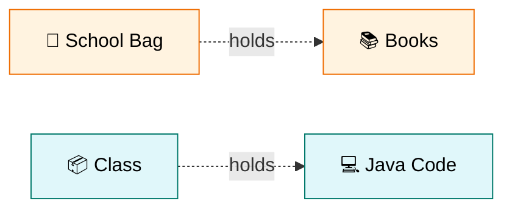
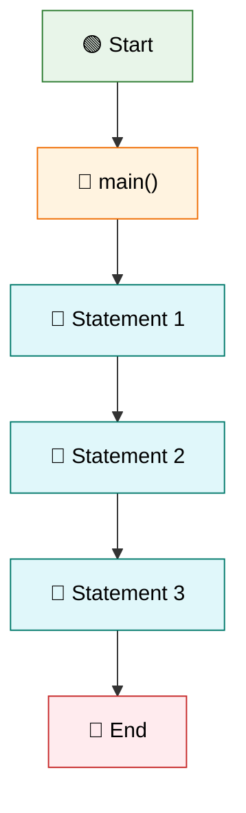
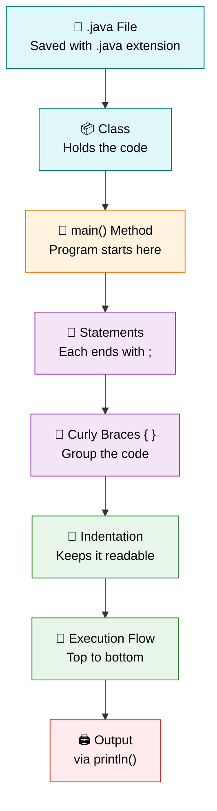

<div align="center">

# 🧱 Level 3 — Understanding Java Program Structure
### *Anatomy of Your First Java Program*


</div>

---

## 🎯 Goal of This Level

> 💬 **Understand how a Java program is written and how Java starts executing it.**

Time to open the hood and see exactly what each piece of a Java program does. 🔧

---

## 📄 Sample Java Program

```java
public class Main {

    public static void main(String[] args) {

        System.out.println("Hello, World!");

    }
}
```

> [!NOTE]
> Keep this program in mind — every concept below is a **building block** of this exact code! 🧩

---

## 🗺️ Your Learning Path

```mermaid
flowchart LR
    A["📄 1. .java<br/>File"] --> B["📦 2.<br/>Class"]
    B --> C["🚪 3. main()<br/>Method"]
    C --> D["🖨️ 4. println()"]
    D --> E["📝 5.<br/>Statements"]
    E --> F["🔹 6.<br/>Semicolon"]
    F --> G["🔲 7. Curly<br/>Braces"]
    G --> H["📐 8.<br/>Indentation"]
    H --> I["🔁 9. Execution<br/>Flow"]
    I --> J["🧑‍💻 Practice<br/>& Summary"]

    style A fill:#e0f7fa,stroke:#00796b,color:#000
    style B fill:#e0f7fa,stroke:#00796b,color:#000
    style C fill:#fff3e0,stroke:#ef6c00,color:#000
    style D fill:#fff3e0,stroke:#ef6c00,color:#000
    style E fill:#f3e5f5,stroke:#8e24aa,color:#000
    style F fill:#f3e5f5,stroke:#8e24aa,color:#000
    style G fill:#f3e5f5,stroke:#8e24aa,color:#000
    style H fill:#e8f5e9,stroke:#2e7d32,color:#000
    style I fill:#e8f5e9,stroke:#2e7d32,color:#000
    style J fill:#ffebee,stroke:#c62828,color:#000
```



---

## ✅ Progress Tracker

- [ ] 1. Java File (`.java`)
- [ ] 2. Class
- [ ] 3. `main()` Method
- [ ] 4. `System.out.println()`
- [ ] 5. Statements
- [ ] 6. Semicolon (`;`)
- [ ] 7. Curly Braces (`{ }`)
- [ ] 8. Indentation
- [ ] 9. Java Execution Flow
- [ ] 🧑‍💻 Practice Exercises
- [ ] 📝 Level 3 Summary

---
---

# 1️⃣ Java File (.java) 📄

<blockquote>

### 📖 Simple Definition
A Java program is saved in a file with the **`.java`** extension.

</blockquote>

### 💡 Suitable Example

> 📝 Just like a Word document is saved as **`.docx`**, a Java program is saved as **`.java`**.

| 📁 Example File Names |
|:---|
| `Main.java` |
| `Student.java` |
| `Calculator.java` |

<details>
<summary>🇮🇳 <b>படிக்க கிளிக் செய்யவும் — Simple Tamil Explanation</b></summary>

<br>

Java Program-ஐ **`.java`** என்ற extension-உடன் Save செய்வோம்.

</details>

> [!TIP]
> ### ⭐ Key Points to Remember
> - Java file ends with **`.java`**
> - Every Java program is saved in a `.java` file.

<div align="right">

[⬆️ Back to Learning Path](#️-your-learning-path)

</div>

---

# 2️⃣ Class 📦

<blockquote>

### 📖 Simple Definition
A **Class** is a container that holds Java code.

</blockquote>

### 💡 Suitable Example

> 🎒 Think of a **school bag**. The bag holds books.
> Similarly, a **Class** holds Java code.



<details>
<summary>🇮🇳 <b>படிக்க கிளிக் செய்யவும் — Simple Tamil Explanation</b></summary>

<br>

**Class** என்பது Java Code-ஐ வைத்திருக்கும் ஒரு Container.

எல்லா Java Code-மும் ஒரு Class-க்குள் எழுதப்படும்.

</details>

> [!TIP]
> ### ⭐ Key Points to Remember
> - Class stores Java code.
> - Every Java program contains at least one class.

<div align="right">

[⬆️ Back to Learning Path](#️-your-learning-path)

</div>

---

# 3️⃣ main() Method 🚪

<blockquote>

### 📖 Simple Definition
The **main()** method is the starting point of every Java program.

</blockquote>

### 💡 Suitable Example

> 🎬 When a movie starts, it begins from the first scene.
> Similarly, Java starts execution from the **main()** method.

<details>
<summary>🇮🇳 <b>படிக்க கிளிக் செய்யவும் — Simple Tamil Explanation</b></summary>

<br>

Java Program Run ஆகும்போது முதலில் **main()** Method-லிருந்து தான் Execution ஆரம்பமாகும்.

</details>

> [!TIP]
> ### ⭐ Key Points to Remember
> - Java starts from **main()**
> - Only one starting point

> [!WARNING]
> ### ⚠️ Common Mistake
> Forgetting to write the **main()** method correctly (spelling, brackets, or signature) means Java has **no starting point** to begin execution!

<div align="right">

[⬆️ Back to Learning Path](#️-your-learning-path)

</div>

---

# 4️⃣ System.out.println() 🖨️

<blockquote>

### 📖 Simple Definition
`System.out.println()` is used to display output on the screen.

</blockquote>

### 💡 Suitable Example

> 🎤 Like speaking through a **microphone** so everyone can hear, `System.out.println()` displays a message on the screen.

**Example:**

```java
System.out.println("Hello");
```

**Output:**

```
Hello
```

<details>
<summary>🇮🇳 <b>படிக்க கிளிக் செய்யவும் — Simple Tamil Explanation</b></summary>

<br>

`System.out.println()` பயன்படுத்தி Screen-ல் Output காட்டலாம்.

</details>

> [!TIP]
> ### ⭐ Key Points to Remember
> - Used to print output.
> - Displays text on the console.

<div align="right">

[⬆️ Back to Learning Path](#️-your-learning-path)

</div>

---

# 5️⃣ Statements 📝

<blockquote>

### 📖 Simple Definition
A statement is a single instruction given to Java.

</blockquote>

### 💡 Suitable Example

> 🚪 "Open the door." <br>
> 💡 "Turn on the light."
>
> Each is **one instruction**.

Similarly:

```java
System.out.println("Hello");
```

is **one statement**.

<details>
<summary>🇮🇳 <b>படிக்க கிளிக் செய்யவும் — Simple Tamil Explanation</b></summary>

<br>

Java-க்கு கொடுக்கப்படும் ஒவ்வொரு Instruction-மும் ஒரு Statement.

</details>

> [!TIP]
> ### ⭐ Key Points to Remember
> - One instruction = One statement
> - Java executes statements one by one

<div align="right">

[⬆️ Back to Learning Path](#️-your-learning-path)

</div>

---

# 6️⃣ Semicolon (;) 🔹

<blockquote>

### 📖 Simple Definition
A semicolon (`;`) marks the end of a Java statement.

</blockquote>

### 💡 Suitable Example

> ✍️ A full stop (`.`) ends an English sentence.
> Similarly, a **semicolon** ends a Java statement.

```java
System.out.println("Hello");
```

<details>
<summary>🇮🇳 <b>படிக்க கிளிக் செய்யவும் — Simple Tamil Explanation</b></summary>

<br>

ஒரு Java Statement முடிந்தது என்பதை **`;`** காட்டுகிறது.

</details>

> [!TIP]
> ### ⭐ Key Points to Remember
> - Every statement ends with `;`
> - Missing `;` causes an error

> [!WARNING]
> ### ⚠️ Common Mistake
> Forgetting the semicolon `;` is one of the **most common beginner errors** — it causes a compilation error!

<div align="right">

[⬆️ Back to Learning Path](#️-your-learning-path)

</div>

---

# 7️⃣ Curly Braces { } 🔲

<blockquote>

### 📖 Simple Definition
Curly braces `{ }` group related code together.

</blockquote>

### 💡 Suitable Example

> 🗂️ A file folder keeps related documents together.
> Similarly, curly braces keep related code together.

<details>
<summary>🇮🇳 <b>படிக்க கிளிக் செய்யவும் — Simple Tamil Explanation</b></summary>

<br>

`{ }` பயன்படுத்தி ஒரே Block-ஆக Code-ஐ எழுதுகிறோம்.

</details>

> [!TIP]
> ### ⭐ Key Points to Remember
> - `{` → Start
> - `}` → End
> - Used to group code

<div align="right">

[⬆️ Back to Learning Path](#️-your-learning-path)

</div>

---

# 8️⃣ Indentation 📐

<blockquote>

### 📖 Simple Definition
Indentation means giving proper spaces to make code neat and readable.

</blockquote>

### 💡 Suitable Example

> 📓 A **well-organized notebook** is easier to read than a messy one.

<details>
<summary>🇮🇳 <b>படிக்க கிளிக் செய்யவும் — Simple Tamil Explanation</b></summary>

<br>

Code அழகாகவும், படிக்க எளிதாகவும் இருக்க Proper Spaces கொடுப்பதையே Indentation என்பார்கள்.

</details>

> [!TIP]
> ### ⭐ Key Points to Remember
> - Makes code readable
> - Improves code organization
> - Good programming practice

<div align="right">

[⬆️ Back to Learning Path](#️-your-learning-path)

</div>

---

# 9️⃣ Java Execution Flow 🔁

<blockquote>

### 📖 Simple Definition
Java executes the program from the **main()** method and runs each statement from top to bottom.

</blockquote>

### 💡 Suitable Example



<details>
<summary>🇮🇳 <b>படிக்க கிளிக் செய்யவும் — Simple Tamil Explanation</b></summary>

<br>

Java Program Run ஆனவுடன்,

- முதலில் `main()` Method-க்கு வரும்.
- பிறகு ஒவ்வொரு Statement-ஐ மேலிருந்து கீழே Execute செய்யும்.

</details>

> [!TIP]
> ### ⭐ Key Points to Remember
> - Starts from `main()`
> - Executes line by line
> - Stops after the last statement

<div align="right">

[⬆️ Back to Learning Path](#️-your-learning-path)

</div>

---
---

# 🧑‍💻 Practice Zone

> Time to try it yourself! Each exercise below reinforces what you just learned. 💪

<details>
<summary>🔓 <b>Practice 1 — Print Your Name</b></summary>

<br>

```java
public class Main {

    public static void main(String[] args) {

        System.out.println("Divakar");

    }
}
```

</details>

<details>
<summary>🔓 <b>Practice 2 — Print College Name</b></summary>

<br>

```java
public class Main {

    public static void main(String[] args) {

        System.out.println("ABC Engineering College");

    }
}
```

</details>

<details>
<summary>🔓 <b>Practice 3 — Print Address</b></summary>

<br>

```java
public class Main {

    public static void main(String[] args) {

        System.out.println("Coimbatore");

    }
}
```

</details>

<details>
<summary>🔓 <b>Practice 4 — Print Multiple Lines</b></summary>

<br>

```java
public class Main {

    public static void main(String[] args) {

        System.out.println("Name : Divakar");
        System.out.println("College : ABC Engineering College");
        System.out.println("City : Coimbatore");

    }
}
```

**✅ Output:**

```
Name : Divakar
College : ABC Engineering College
City : Coimbatore
```

</details>

---
---

<div align="center">

# 📝 Level 3 Summary

### 🏁 You now understand Java program structure!

</div>

## 📖 What You Learned

<details open>
<summary><b>📚 Click to expand / collapse the full topic list</b></summary>

<br>

1. ✅ Java File (`.java`)
2. ✅ Class
3. ✅ `main()` Method
4. ✅ `System.out.println()`
5. ✅ Statements
6. ✅ Semicolon (`;`)
7. ✅ Curly Braces (`{}`)
8. ✅ Indentation
9. ✅ Java Execution Flow

</details>

---

## ⭐ Final Key Points to Remember

> [!IMPORTANT]
>
> | # | Concept | Key Idea |
> |:---:|:---|:---|
> | 1️⃣ | **`.java` File** | Java programs are saved with the `.java` extension |
> | 2️⃣ | **Class** | Holds Java code |
> | 3️⃣ | **main()** | The starting point of every Java program |
> | 4️⃣ | **println()** | Prints output to the screen |
> | 5️⃣ | **Statement** | Every instruction is called a statement |
> | 6️⃣ | **Semicolon** | Every statement ends with `;` |
> | 7️⃣ | **Curly Braces** | `{}` group related code |
> | 8️⃣ | **Indentation** | Makes code neat and readable |
> | 9️⃣ | **Execution Flow** | Runs top to bottom, starting with `main()` |

---

## 🔁 Quick Revision — The Big Picture



---

<div align="center">

> 🎉 **Congratulations!** You've completed **Level 3 — Understanding Java Program Structure**.
>
> You can now read and understand every part of a Java program.
>
> ### ➡️ Ready for **Level 4**? Keep building! 🚀

---

**📌 Level 3 · Understanding Java Program Structure · Beginner Track**

</div>
