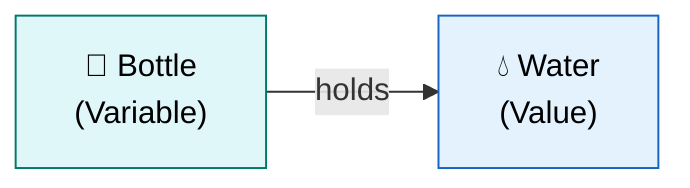
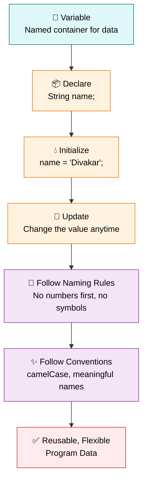

<div align="center">

# 🧃 Level 4 — Variables
### *Learn How Java Stores Information*


</div>

---

## 🎯 Goal of This Level

> 💬 **Learn how computers store information using variables.**

Variables are the memory boxes of your program — let's understand them fully. 📦

---

## 🗺️ Your Learning Path

```mermaid
flowchart LR
    A["🧃 1. What is a<br/>Variable?"] --> B["❓ 2. Why Variables<br/>are Needed?"]
    B --> C["📦 3. Declaring<br/>Variables"]
    C --> D["💧 4. Initializing<br/>Variables"]
    D --> E["🔄 5. Updating<br/>Values"]
    E --> F["📏 6. Naming<br/>Rules"]
    F --> G["✨ 7. Naming<br/>Conventions"]
    G --> H["🧑‍💻 Practice<br/>& Summary"]

    style A fill:#e0f7fa,stroke:#00796b,color:#000
    style B fill:#e0f7fa,stroke:#00796b,color:#000
    style C fill:#fff3e0,stroke:#ef6c00,color:#000
    style D fill:#fff3e0,stroke:#ef6c00,color:#000
    style E fill:#fff3e0,stroke:#ef6c00,color:#000
    style F fill:#f3e5f5,stroke:#8e24aa,color:#000
    style G fill:#f3e5f5,stroke:#8e24aa,color:#000
    style H fill:#ffebee,stroke:#c62828,color:#000
```



---

## ✅ Progress Tracker

- [ ] 1. What is a Variable?
- [ ] 2. Why Variables are Needed?
- [ ] 3. Declaring Variables
- [ ] 4. Initializing Variables
- [ ] 5. Updating Variable Values
- [ ] 6. Variable Naming Rules
- [ ] 7. Variable Naming Conventions
- [ ] 🧑‍💻 Practice Exercises
- [ ] 📝 Level 4 Summary

---
---

# 1️⃣ What is a Variable? 🧃

<blockquote>

### 📖 Simple Definition
A **variable** is a named container used to store data.

</blockquote>

### 💡 Suitable Example

> 🍼 Think of a **water bottle**.

| Real World | Programming |
|:---|:---|
| 🍼 Bottle | = Variable |
| 💧 Water | = Value |

> The bottle stores water, just like a variable stores data.



<details>
<summary>🇮🇳 <b>படிக்க கிளிக் செய்யவும் — Simple Tamil Explanation</b></summary>

<br>

**Variable** என்பது **தகவலை (Data) சேமித்து வைக்கும் ஒரு Container**.

ஒரு தண்ணீர் பாட்டில் தண்ணீரை வைத்திருப்பது போல, Variable தகவலை வைத்திருக்கும்.

</details>

> [!TIP]
> ### ⭐ Key Points to Remember
> - Variable stores data.
> - Variable has a name.
> - Value can change later.

<div align="right">

[⬆️ Back to Learning Path](#️-your-learning-path)

</div>

---

# 2️⃣ Why Variables are Needed? ❓

<blockquote>

### 📖 Simple Definition
Variables are used to store data so that we can use it whenever needed.

</blockquote>

### 💡 Suitable Example

> 📱 Instead of remembering your mobile number every time, you save it in your **contacts**.
>
> Similarly, a program stores data in **variables**.

<details>
<summary>🇮🇳 <b>படிக்க கிளிக் செய்யவும் — Simple Tamil Explanation</b></summary>

<br>

ஒரு தகவலை மீண்டும் மீண்டும் பயன்படுத்த வேண்டுமெனில் அதை Variable-ல் சேமிக்கிறோம்.

</details>

> [!TIP]
> ### ⭐ Key Points to Remember
> - Stores data.
> - Reuse data anytime.
> - Makes programs easier.

<div align="right">

[⬆️ Back to Learning Path](#️-your-learning-path)

</div>

---

# 3️⃣ Declaring Variables 📦

<blockquote>

### 📖 Simple Definition
Declaring a variable means creating a variable by specifying its **data type** and **name**.

</blockquote>

### 💡 Suitable Example

> 📓 Before using a new notebook, you first **buy it**.
>
> Similarly, before storing data, you first **create a variable**.

```java
String name;
```

<details>
<summary>🇮🇳 <b>படிக்க கிளிக் செய்யவும் — Simple Tamil Explanation</b></summary>

<br>

Variable உருவாக்குவதை **Declaration** என்பார்கள்.

இப்போது Variable உருவாகியுள்ளது. ஆனால் அதில் இன்னும் Value இல்லை.

</details>

> [!TIP]
> ### ⭐ Key Points to Remember
> - Declaration = Creating a variable.
> - No value is stored yet.

<div align="right">

[⬆️ Back to Learning Path](#️-your-learning-path)

</div>

---

# 4️⃣ Initializing Variables 💧

<blockquote>

### 📖 Simple Definition
Initializing means assigning the first value to a variable.

</blockquote>

### 💡 Suitable Example

> 🍼 After buying a water bottle, you **fill it with water**.
>
> Similarly, after creating a variable, you **store a value** in it.

```java
String name = "Divakar";
```

<details>
<summary>🇮🇳 <b>படிக்க கிளிக் செய்யவும் — Simple Tamil Explanation</b></summary>

<br>

Variable-க்கு முதல் முறையாக Value கொடுப்பதை **Initialization** என்பார்கள்.

</details>

> [!TIP]
> ### ⭐ Key Points to Remember
> - Initialization = Assigning the first value.
> - Variable becomes ready to use.

<div align="right">

[⬆️ Back to Learning Path](#️-your-learning-path)

</div>

---

# 5️⃣ Updating Variable Values 🔄

<blockquote>

### 📖 Simple Definition
Updating means changing the value stored in a variable.

</blockquote>

### 💡 Suitable Example

> 🎂 Today your age is **20**. Next year it becomes **21**.
>
> The value changes.

```java
int age = 20;
age = 21;
```

<details>
<summary>🇮🇳 <b>படிக்க கிளிக் செய்யவும் — Simple Tamil Explanation</b></summary>

<br>

Variable-ல் இருக்கும் பழைய Value-ஐ மாற்றி புதிய Value கொடுப்பது **Updating**.

</details>

> [!TIP]
> ### ⭐ Key Points to Remember
> - Values can change.
> - Latest value replaces the old value.

<div align="right">

[⬆️ Back to Learning Path](#️-your-learning-path)

</div>

---

# 6️⃣ Variable Naming Rules 📏

<blockquote>

### 📖 Simple Definition
Variables must follow Java naming rules.

</blockquote>

### 💡 Suitable Example

| ✅ Correct | ❌ Incorrect |
|:---|:---|
| `name` | `1name` |
| `age` | `student-name` |
| `studentName` | `class` |
| `cgpa` | |

```java
// ✅ Correct
name
age
studentName
cgpa
```

```java
// ❌ Incorrect
1name
student-name
class
```

<details>
<summary>🇮🇳 <b>படிக்க கிளிக் செய்யவும் — Simple Tamil Explanation</b></summary>

<br>

Variable Name வைக்கும் போது Java Rules-ஐ பின்பற்ற வேண்டும்.

</details>

> [!TIP]
> ### ⭐ Key Points to Remember
> - Cannot start with a number.
> - No spaces.
> - No special symbols like `-`, `@`, `#`.
> - Keywords cannot be used.

> [!WARNING]
> ### ⚠️ Common Mistake
> Using a Java **keyword** (like `class`) as a variable name will cause an error!

<div align="right">

[⬆️ Back to Learning Path](#️-your-learning-path)

</div>

---

# 7️⃣ Variable Naming Conventions ✨

<blockquote>

### 📖 Simple Definition
Naming conventions are recommended ways of naming variables to make code easy to read.

</blockquote>

### 💡 Suitable Example

| ✅ Good | ❌ Bad |
|:---|:---|
| `studentName` | `a` |
| `mobileNumber` | `x` |
| `collegeName` | `abc` |
| `cgpa` | `data1` |

```java
// ✅ Good
studentName
mobileNumber
collegeName
cgpa
```

```java
// ❌ Bad
a
x
abc
data1
```

<details>
<summary>🇮🇳 <b>படிக்க கிளிக் செய்யவும் — Simple Tamil Explanation</b></summary>

<br>

Variable Name பார்த்தவுடன் அது என்ன தகவலை வைத்திருக்கிறது என்று புரிய வேண்டும்.

அதனால் Meaningful Names பயன்படுத்த வேண்டும்.

</details>

> [!TIP]
> ### ⭐ Key Points to Remember
> - Use meaningful names.
> - Follow **camelCase**.
> - Keep names simple and clear.

> [!NOTE]
> ### ✨ Best Practice
> A good variable name explains itself — `studentName` is instantly clear, while `x` leaves everyone guessing! 🕵️

<div align="right">

[⬆️ Back to Learning Path](#️-your-learning-path)

</div>

---
---

# 🧑‍💻 Practice Zone

> Time to put variables into action! 💪

<details>
<summary>🔓 <b>Store Name</b></summary>

<br>

```java
String name = "Divakar";
```

</details>

<details>
<summary>🔓 <b>Store Age</b></summary>

<br>

```java
int age = 20;
```

</details>

<details>
<summary>🔓 <b>Store College</b></summary>

<br>

```java
String college = "ABC Engineering College";
```

</details>

<details>
<summary>🔓 <b>Store CGPA</b></summary>

<br>

```java
double cgpa = 8.75;
```

</details>

<details>
<summary>🔓 <b>Store Mobile Number</b></summary>

<br>

```java
long mobileNumber = 9876543210L;
```

</details>

<details open>
<summary>🔓 <b>Complete Practice Program</b></summary>

<br>

```java
public class Main {

    public static void main(String[] args) {

        String name = "Divakar";
        int age = 20;
        String college = "ABC Engineering College";
        double cgpa = 8.75;
        long mobileNumber = 9876543210L;

        System.out.println("Name : " + name);
        System.out.println("Age : " + age);
        System.out.println("College : " + college);
        System.out.println("CGPA : " + cgpa);
        System.out.println("Mobile Number : " + mobileNumber);

    }
}
```

**✅ Output:**

```
Name : Divakar
Age : 20
College : ABC Engineering College
CGPA : 8.75
Mobile Number : 9876543210
```

</details>

---
---

<div align="center">

# 📝 Level 4 Summary

### 🏁 You can now store and manage data in Java!

</div>

## 📖 What You Learned

<details open>
<summary><b>📚 Click to expand / collapse the full topic list</b></summary>

<br>

1. ✅ What is a Variable?
2. ✅ Why Variables are Needed
3. ✅ Declaring Variables
4. ✅ Initializing Variables
5. ✅ Updating Variable Values
6. ✅ Variable Naming Rules
7. ✅ Variable Naming Conventions

</details>

---

## ⭐ Final Key Points to Remember

> [!IMPORTANT]
>
> | # | Concept | Key Idea |
> |:---:|:---|:---|
> | 1️⃣ | **Variable** | Named container to store data |
> | 2️⃣ | **Declaration** | Creating a variable |
> | 3️⃣ | **Initialization** | Giving the first value |
> | 4️⃣ | **Updating** | Changing the value |
> | 5️⃣ | **Naming** | Use meaningful variable names |
> | 6️⃣ | **Rules** | Follow Java naming rules |
> | 7️⃣ | **Benefit** | Variables make programs flexible and reusable |

---

## 🔁 Quick Revision — The Big Picture



---

<div align="center">

> 🎉 **Congratulations!** You've completed **Level 4 — Variables**.
>
> You now know how to store, initialize, update, and name data in Java.
>
> ### ➡️ Ready for **Level 5**? Onward! 🚀

---

**📌 Level 4 · Variables · Beginner Track**

</div>
