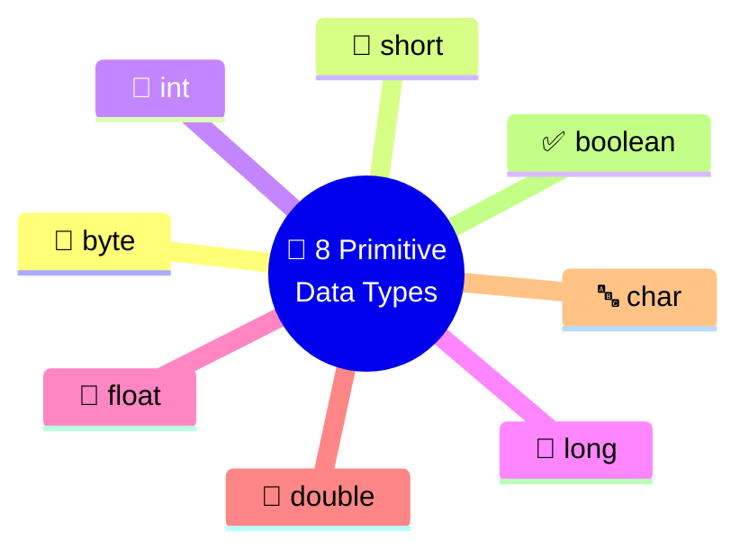
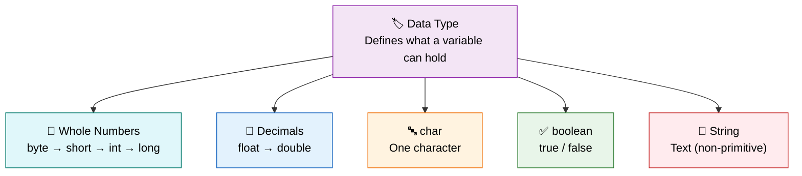

<div align="center">

# 🏷️ Level 5 — Data Types
### *Choosing the Right Container for Every Kind of Data*


</div>

---

## 🎯 Goal of This Level

> 💬 **Learn how to choose the correct data type for different kinds of information.**

Every piece of data has a home — let's find the right box for each one. 📦

---

## 🗺️ Your Learning Path

```mermaid
flowchart LR
    A["🏷️ 1. What is a<br/>Data Type?"] --> B["🧱 2. Primitive<br/>Data Types"]
    B --> C["🔢 3-6. Whole Numbers<br/>byte · short · int · long"]
    C --> D["🌊 7-8. Decimals<br/>float · double"]
    D --> E["🔤 9. char"]
    E --> F["✅ 10.<br/>boolean"]
    F --> G["📝 11.<br/>String"]
    G --> H["🧑‍💻 Practice<br/>& Summary"]

    style A fill:#e0f7fa,stroke:#00796b,color:#000
    style B fill:#e0f7fa,stroke:#00796b,color:#000
    style C fill:#fff3e0,stroke:#ef6c00,color:#000
    style D fill:#fff3e0,stroke:#ef6c00,color:#000
    style E fill:#f3e5f5,stroke:#8e24aa,color:#000
    style F fill:#f3e5f5,stroke:#8e24aa,color:#000
    style G fill:#f3e5f5,stroke:#8e24aa,color:#000
    style H fill:#ffebee,stroke:#c62828,color:#000
```



---

## ✅ Progress Tracker

- [ ] 1. What is a Data Type?
- [ ] 2. Primitive Data Types
- [ ] 3. `byte`
- [ ] 4. `short`
- [ ] 5. `int`
- [ ] 6. `long`
- [ ] 7. `float`
- [ ] 8. `double`
- [ ] 9. `char`
- [ ] 10. `boolean`
- [ ] 11. `String` (Basic Introduction)
- [ ] 📋 Quick Summary Table
- [ ] 🧑‍💻 Practice Exercises
- [ ] 📝 Level 5 Summary

---
---

# 1️⃣ What is a Data Type? 🏷️

<blockquote>

### 📖 Simple Definition
A **Data Type** tells Java what kind of data a variable can store.

</blockquote>

### 💡 Suitable Example

> 🧰 Think of different containers:

| 📦 Container | 🎯 Stores |
|:---|:---|
| 🍼 Water Bottle | Water |
| ✏️ Pencil Box | Pencils |
| 👛 Wallet | Money |

> Each container stores a specific thing.
> Similarly, each data type stores a specific kind of data.

<details>
<summary>🇮🇳 <b>படிக்க கிளிக் செய்யவும் — Simple Tamil Explanation</b></summary>

<br>

**Data Type** என்பது ஒரு Variable-ல் எந்த வகையான தகவலை (Data) சேமிக்கலாம் என்று Java-க்கு சொல்லுகிறது.

</details>

> [!TIP]
> ### ⭐ Key Points to Remember
> - Data Type decides what data can be stored.
> - Every variable must have a data type.

<div align="right">

[⬆️ Back to Learning Path](#️-your-learning-path)

</div>

---

# 2️⃣ Primitive Data Types 🧱

<blockquote>

### 📖 Simple Definition
Primitive Data Types are Java's basic built-in data types.

</blockquote>

### 💡 Suitable Example

> 🔤 Just like the **alphabet** is the foundation of a language, primitive data types are the foundation of Java.

<details>
<summary>🇮🇳 <b>படிக்க கிளிக் செய்யவும் — Simple Tamil Explanation</b></summary>

<br>

Java-வில் உள்ள அடிப்படை (Basic) Data Types-களை **Primitive Data Types** என்பார்கள்.

</details>

> [!TIP]
> ### ⭐ Key Points to Remember
> - Java has **8 Primitive Data Types**.
> - Used to store basic values.



<div align="right">

[⬆️ Back to Learning Path](#️-your-learning-path)

</div>

---

# 3️⃣ byte 🔹

<blockquote>

### 📖 Simple Definition
`byte` stores **small whole numbers**.

</blockquote>

### 💡 Suitable Example

> 🏫 Store the number of students in a small classroom.

```java
byte students = 45;
```

<details>
<summary>🇮🇳 <b>படிக்க கிளிக் செய்யவும் — Simple Tamil Explanation</b></summary>

<br>

`byte` சிறிய முழு எண்களை (Whole Numbers) சேமிக்க பயன்படுகிறது.

</details>

> [!TIP]
> ### ⭐ Key Points to Remember
> - Small integers
> - No decimal values

<div align="right">

[⬆️ Back to Learning Path](#️-your-learning-path)

</div>

---

# 4️⃣ short 🔸

<blockquote>

### 📖 Simple Definition
`short` stores **medium-sized whole numbers**.

</blockquote>

### 💡 Suitable Example

> 📚 Store the number of books in a library section.

```java
short books = 1200;
```

<details>
<summary>🇮🇳 <b>படிக்க கிளிக் செய்யவும் — Simple Tamil Explanation</b></summary>

<br>

`short` என்பது `byte`-ஐ விட பெரிய முழு எண்களை சேமிக்க பயன்படும்.

</details>

> [!TIP]
> ### ⭐ Key Points to Remember
> - Medium-sized integers
> - No decimal values

<div align="right">

[⬆️ Back to Learning Path](#️-your-learning-path)

</div>

---

# 5️⃣ int 🔢

<blockquote>

### 📖 Simple Definition
`int` stores **whole numbers** and is the most commonly used integer data type.

</blockquote>

### 💡 Suitable Example

> 🎓 Store a student's age or marks.

```java
int age = 20;
```

<details>
<summary>🇮🇳 <b>படிக்க கிளிக் செய்யவும் — Simple Tamil Explanation</b></summary>

<br>

`int` என்பது Java-வில் அதிகமாக பயன்படுத்தப்படும் முழு எண் Data Type.

</details>

> [!TIP]
> ### ⭐ Key Points to Remember
> - Most commonly used
> - Stores whole numbers
> - No decimal values

<div align="right">

[⬆️ Back to Learning Path](#️-your-learning-path)

</div>

---

# 6️⃣ long 📈

<blockquote>

### 📖 Simple Definition
`long` stores **very large whole numbers**.

</blockquote>

### 💡 Suitable Example

> 📱 Store a mobile number or country's population.

```java
long mobileNumber = 9876543210L;
```

<details>
<summary>🇮🇳 <b>படிக்க கிளிக் செய்யவும் — Simple Tamil Explanation</b></summary>

<br>

`long` என்பது மிகவும் பெரிய முழு எண்களை சேமிக்க பயன்படும்.

</details>

> [!TIP]
> ### ⭐ Key Points to Remember
> - Large integers
> - Add `L` at the end for large values

<div align="right">

[⬆️ Back to Learning Path](#️-your-learning-path)

</div>

---

# 7️⃣ float 🌊

<blockquote>

### 📖 Simple Definition
`float` stores decimal numbers.

</blockquote>

### 💡 Suitable Example

> 🛍️ Store the price of a product.

```java
float price = 199.99f;
```

<details>
<summary>🇮🇳 <b>படிக்க கிளிக் செய்யவும் — Simple Tamil Explanation</b></summary>

<br>

`float` என்பது தசம எண்களை (Decimal Numbers) சேமிக்க பயன்படும்.

</details>

> [!TIP]
> ### ⭐ Key Points to Remember
> - Stores decimal values
> - Add `f` at the end

<div align="right">

[⬆️ Back to Learning Path](#️-your-learning-path)

</div>

---

# 8️⃣ double 🌊✨

<blockquote>

### 📖 Simple Definition
`double` stores decimal numbers with higher precision.

</blockquote>

### 💡 Suitable Example

> 🎓 Store a student's CGPA.

```java
double cgpa = 8.75;
```

<details>
<summary>🇮🇳 <b>படிக்க கிளிக் செய்யவும் — Simple Tamil Explanation</b></summary>

<br>

`double` என்பது Decimal Values-ஐ மிகவும் துல்லியமாக (More Accurate) சேமிக்கும்.

</details>

> [!TIP]
> ### ⭐ Key Points to Remember
> - Decimal values
> - More accurate than `float`
> - Most commonly used for decimals

<div align="right">

[⬆️ Back to Learning Path](#️-your-learning-path)

</div>

---

# 9️⃣ char 🔤

<blockquote>

### 📖 Simple Definition
`char` stores **only one character**.

</blockquote>

### 💡 Suitable Example

> ✍️ Store the first letter of your name.

```java
char grade = 'A';
```

<details>
<summary>🇮🇳 <b>படிக்க கிளிக் செய்யவும் — Simple Tamil Explanation</b></summary>

<br>

`char` ஒரு எழுத்தை (Single Character) மட்டும் சேமிக்கும்.

</details>

> [!TIP]
> ### ⭐ Key Points to Remember
> - Stores only one character
> - Uses single quotes `' '`

<div align="right">

[⬆️ Back to Learning Path](#️-your-learning-path)

</div>

---

# 🔟 boolean ✅

<blockquote>

### 📖 Simple Definition
`boolean` stores only **true** or **false**.

</blockquote>

### 💡 Suitable Example

> ❓ Is the student present?
> - true
> - false

```java
boolean isPresent = true;
```

<details>
<summary>🇮🇳 <b>படிக்க கிளிக் செய்யவும் — Simple Tamil Explanation</b></summary>

<br>

`boolean` இரண்டு மதிப்புகளை மட்டும் சேமிக்கும்.

- true
- false

</details>

> [!TIP]
> ### ⭐ Key Points to Remember
> - Only true or false
> - Used for decisions

<div align="right">

[⬆️ Back to Learning Path](#️-your-learning-path)

</div>

---

# 1️⃣1️⃣ String (Basic Introduction) 📝

<blockquote>

### 📖 Simple Definition
`String` is used to store text or multiple characters.

</blockquote>

### 💡 Suitable Example

> 🎓 Store your name or college name.

```java
String name = "Divakar";
```

<details>
<summary>🇮🇳 <b>படிக்க கிளிக் செய்யவும் — Simple Tamil Explanation</b></summary>

<br>

`String` என்பது வார்த்தைகள் அல்லது வாக்கியங்களை (Text) சேமிக்க பயன்படும்.

</details>

> [!TIP]
> ### ⭐ Key Points to Remember
> - Stores text
> - Uses double quotes `" "`
> - Not a primitive data type

> [!NOTE]
> ### 🧠 Good to Know
> Unlike the 8 primitive types, `String` is a **non-primitive** (reference) type in Java!

<div align="right">

[⬆️ Back to Learning Path](#️-your-learning-path)

</div>

---
---

# 📋 Quick Summary Table

| Data Type | Stores | Example |
|:---|:---|:---|
| 🔹 `byte` | Small whole numbers | `50` |
| 🔸 `short` | Medium whole numbers | `1200` |
| 🔢 `int` | Whole numbers | `20` |
| 📈 `long` | Large whole numbers | `9876543210L` |
| 🌊 `float` | Decimal numbers | `99.5f` |
| 🌊✨ `double` | Accurate decimal numbers | `8.75` |
| 🔤 `char` | Single character | `'A'` |
| ✅ `boolean` | true / false | `true` |
| 📝 `String` | Text | `"Divakar"` |

---
---

# 🧑‍💻 Practice Zone

> Let's apply data types to real-world entities! 💪

<details>
<summary>🔓 <b>Student</b></summary>

<br>

```java
String studentName = "Divakar";
int age = 20;
char grade = 'A';
double cgpa = 8.75;
boolean isPresent = true;
```

</details>

<details>
<summary>🔓 <b>Product</b></summary>

<br>

```java
String productName = "Laptop";
double price = 55000.50;
int quantity = 10;
```

</details>

<details>
<summary>🔓 <b>Employee</b></summary>

<br>

```java
String employeeName = "Rahul";
int employeeId = 101;
double salary = 45000.00;
boolean isWorking = true;
```

</details>

---
---

<div align="center">

# 📝 Level 5 Summary

### 🏁 You now know how to pick the right data type!

</div>

## 📖 What You Learned

<details open>
<summary><b>📚 Click to expand / collapse the full topic list</b></summary>

<br>

1. ✅ What is a Data Type?
2. ✅ Primitive Data Types
3. ✅ `byte`
4. ✅ `short`
5. ✅ `int`
6. ✅ `long`
7. ✅ `float`
8. ✅ `double`
9. ✅ `char`
10. ✅ `boolean`
11. ✅ `String` (Basic Introduction)

</details>

---

## ⭐ Final Key Points to Remember

> [!IMPORTANT]
>
> | # | Concept | Key Idea |
> |:---:|:---|:---|
> | 1️⃣ | **Data Type** | Tells Java what kind of data a variable can store |
> | 2️⃣ | **Primitive Types** | Java has **8 Primitive Data Types** |
> | 3️⃣ | **int** | Commonly used for whole numbers |
> | 4️⃣ | **double** | Commonly used for decimal numbers |
> | 5️⃣ | **char** | Stores one character |
> | 6️⃣ | **boolean** | Stores only `true` or `false` |
> | 7️⃣ | **String** | Stores text and is **not** a primitive data type |
> | 8️⃣ | **Choosing** | Pick the data type based on the kind of information |

---

## 🔁 Quick Revision — The Big Picture



---

<div align="center">

> 🎉 **Congratulations!** You've completed **Level 5 — Data Types**.
>
> You now know exactly which data type to choose for any kind of information.
>
> ### ➡️ Ready for **Level 6**? Keep going! 🚀

---

**📌 Level 5 · Data Types · Beginner Track**

</div>
