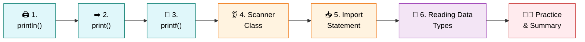
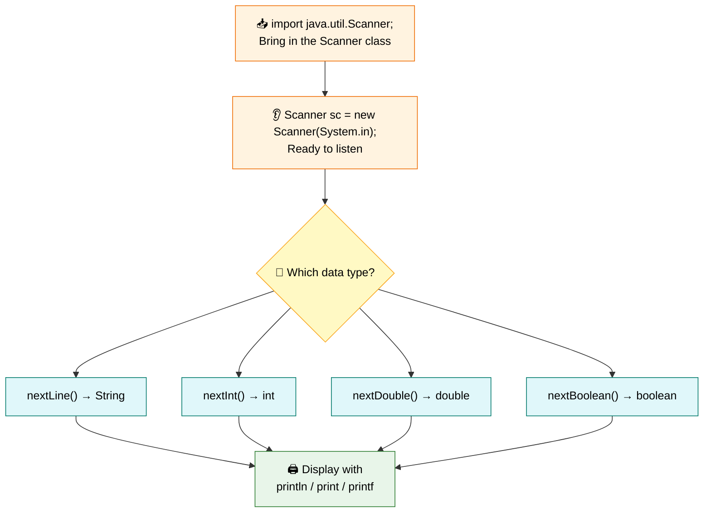

<div align="center">

# 🎤 Level 6 — Input & Output
### *Making Your Programs Talk and Listen*


</div>

---

## 🎯 Goal of This Level

> 💬 **Learn how to take input from the user and display output on the screen.**

Time to make your programs **interactive** — talking to the user and listening back! 🗣️👂

---

## 🗺️ Your Learning Path



---

## ✅ Progress Tracker

- [ ] 1. Output using `println()`
- [ ] 2. Output using `print()`
- [ ] 3. Output using `printf()`
- [ ] 4. Scanner Class
- [ ] 5. Import Statement
- [ ] 6. Reading Different Data Types
- [ ] 🧑‍💻 Practice Exercises
- [ ] 📝 Level 6 Summary

---
---

# 1️⃣ Output using println() 🖨️

<blockquote>

### 📖 Simple Definition
`println()` is used to display output on the screen and move the cursor to the next line.

</blockquote>

### 💡 Suitable Example

> ⏎ Like pressing **Enter** after writing a sentence.

```java
System.out.println("Hello");
System.out.println("Welcome");
```

**Output:**

```
Hello
Welcome
```

<details>
<summary>🇮🇳 <b>படிக்க கிளிக் செய்யவும் — Simple Tamil Explanation</b></summary>

<br>

`println()` பயன்படுத்தி Output Screen-ல் காட்டலாம்.

ஒவ்வொரு `println()`-க்கும் பிறகு அடுத்த வரிக்கு (Next Line) செல்லும்.

</details>

> [!TIP]
> ### ⭐ Key Points to Remember
> - Prints output.
> - Moves to the next line automatically.

<div align="right">

[⬆️ Back to Learning Path](#️-your-learning-path)

</div>

---

# 2️⃣ Output using print() ➡️

<blockquote>

### 📖 Simple Definition
`print()` displays output but does **not** move to the next line.

</blockquote>

### 💡 Suitable Example

> ➡️ Continue writing on the same line without pressing **Enter**.

```java
System.out.print("Hello ");
System.out.print("World");
```

**Output:**

```
Hello World
```

<details>
<summary>🇮🇳 <b>படிக்க கிளிக் செய்யவும் — Simple Tamil Explanation</b></summary>

<br>

`print()` Output-ஐ Screen-ல் காட்டும்.

ஆனால் அடுத்த வரிக்கு செல்லாது.

</details>

> [!TIP]
> ### ⭐ Key Points to Remember
> - Prints output.
> - Stays on the same line.

<div align="right">

[⬆️ Back to Learning Path](#️-your-learning-path)

</div>

---

# 3️⃣ Output using printf() 🎨

<blockquote>

### 📖 Simple Definition
`printf()` is used to print formatted output.

</blockquote>

### 💡 Suitable Example

> 📋 Printing a report where values are displayed in a neat format.

```java
String name = "Divakar";
int age = 20;

System.out.printf("Name: %s Age: %d", name, age);
```

**Output:**

```
Name: Divakar Age: 20
```

<details>
<summary>🇮🇳 <b>படிக்க கிளிக் செய்யவும் — Simple Tamil Explanation</b></summary>

<br>

`printf()` பயன்படுத்தி Output-ஐ அழகாக (Formatted) காட்டலாம்.

</details>

> [!TIP]
> ### ⭐ Key Points to Remember
> - Used for formatted output.

| Format Specifier | Meaning |
|:---:|:---|
| `%s` | String |
| `%d` | int |
| `%f` | Decimal |

<div align="right">

[⬆️ Back to Learning Path](#️-your-learning-path)

</div>

---

## 🔍 Quick Comparison — println() vs print() vs printf()

| Method | Moves to Next Line? | Best For |
|:---|:---:|:---|
| `println()` | ✅ Yes | Simple line-by-line output |
| `print()` | ❌ No | Output on the same line |
| `printf()` | ❌ No | Neatly formatted output |

---

# 4️⃣ Scanner Class 👂

<blockquote>

### 📖 Simple Definition
`Scanner` is used to get input from the user.

</blockquote>

### 💡 Suitable Example

> 👩‍🏫 Just like a **teacher asks a question and waits for your answer**, `Scanner` waits for the user's input.

```java
Scanner sc = new Scanner(System.in);
```

<details>
<summary>🇮🇳 <b>படிக்க கிளிக் செய்யவும் — Simple Tamil Explanation</b></summary>

<br>

**Scanner** என்பது User-கிட்ட இருந்து Input வாங்க பயன்படும் Class.

</details>

> [!TIP]
> ### ⭐ Key Points to Remember
> - Used to take input.
> - Reads values typed by the user.

<div align="right">

[⬆️ Back to Learning Path](#️-your-learning-path)

</div>

---

# 5️⃣ Import Statement 📥

<blockquote>

### 📖 Simple Definition
An **import statement** tells Java to use a class from another package.

</blockquote>

### 💡 Suitable Example

> 📚 Before borrowing a book from the library, you must first **enter the library**.
>
> Similarly, before using `Scanner`, we must **import** it.

```java
import java.util.Scanner;
```

<details>
<summary>🇮🇳 <b>படிக்க கிளிக் செய்யவும் — Simple Tamil Explanation</b></summary>

<br>

`Scanner` பயன்படுத்துவதற்கு முன் அதை `import` செய்ய வேண்டும்.

</details>

> [!TIP]
> ### ⭐ Key Points to Remember
> - Required for Scanner.
> - Written at the top of the program.

<div align="right">

[⬆️ Back to Learning Path](#️-your-learning-path)

</div>

---

# 6️⃣ Reading Different Data Types 🔑

<blockquote>

### 📖 Simple Definition
Scanner provides different methods to read different types of data.

</blockquote>

### 💡 Suitable Example

> 🔑 Different keys open different locks.
>
> Similarly, different methods read different data types.

```java
nextLine()   // String
nextInt()    // int
nextDouble() // double
nextBoolean()// boolean
```

<details>
<summary>🇮🇳 <b>படிக்க கிளிக் செய்யவும் — Simple Tamil Explanation</b></summary>

<br>

ஒவ்வொரு Data Type-க்கும் Scanner-ல் தனித்தனி Method உள்ளது.

</details>

> [!TIP]
> ### ⭐ Key Points to Remember

| Method | Reads |
|:---|:---|
| `nextLine()` | String |
| `nextInt()` | int |
| `nextDouble()` | double |
| `nextBoolean()` | boolean |

> [!WARNING]
> ### ⚠️ Common Mistake
> Calling `nextInt()` and then `nextLine()` right after can leave leftover input in the buffer — often you'll need an extra `sc.nextLine();` to clear it before reading the next line of text!

<div align="right">

[⬆️ Back to Learning Path](#️-your-learning-path)

</div>

---
---

# 🧑‍💻 Practice Zone

> Let's build a fully interactive program step by step! 💪

<details>
<summary>🔓 <b>Ask User for Name</b></summary>

<br>

```java
import java.util.Scanner;

public class Main {

    public static void main(String[] args) {

        Scanner sc = new Scanner(System.in);

        System.out.print("Enter Name: ");
        String name = sc.nextLine();

        System.out.println("Name: " + name);
    }
}
```

</details>

<details>
<summary>🔓 <b>Ask User for Age</b></summary>

<br>

```java
System.out.print("Enter Age: ");
int age = sc.nextInt();
```

</details>

<details>
<summary>🔓 <b>Ask User for City</b></summary>

<br>

```java
System.out.print("Enter City: ");
sc.nextLine(); // Clear leftover input
String city = sc.nextLine();
```

</details>

<details>
<summary>🔓 <b>Ask User for Marks</b></summary>

<br>

```java
System.out.print("Enter Marks: ");
double marks = sc.nextDouble();
```

</details>

<details open>
<summary>🔓 <b>Complete Practice Program</b></summary>

<br>

```java
import java.util.Scanner;

public class Main {

    public static void main(String[] args) {

        Scanner sc = new Scanner(System.in);

        System.out.print("Enter Name: ");
        String name = sc.nextLine();

        System.out.print("Enter Age: ");
        int age = sc.nextInt();

        sc.nextLine(); // Clear buffer

        System.out.print("Enter City: ");
        String city = sc.nextLine();

        System.out.print("Enter Marks: ");
        double marks = sc.nextDouble();

        System.out.println("\n------ Student Details ------");
        System.out.println("Name  : " + name);
        System.out.println("Age   : " + age);
        System.out.println("City  : " + city);
        System.out.println("Marks : " + marks);

        sc.close();
    }
}
```

**✅ Sample Output:**

```
Enter Name: Divakar
Enter Age: 20
Enter City: Coimbatore
Enter Marks: 89.5

------ Student Details ------
Name  : Divakar
Age   : 20
City  : Coimbatore
Marks : 89.5
```

</details>

---
---

<div align="center">

# 📝 Level 6 Summary

### 🏁 Your programs can now interact with users!

</div>

## 📖 What You Learned

<details open>
<summary><b>📚 Click to expand / collapse the full topic list</b></summary>

<br>

1. ✅ `println()`
2. ✅ `print()`
3. ✅ `printf()`
4. ✅ Scanner Class
5. ✅ Import Statement
6. ✅ Reading Different Data Types

</details>

---

## ⭐ Final Key Points to Remember

> [!IMPORTANT]
>
> | # | Concept | Key Idea |
> |:---:|:---|:---|
> | 1️⃣ | **println()** | Prints and moves to the next line |
> | 2️⃣ | **print()** | Prints on the same line |
> | 3️⃣ | **printf()** | Prints formatted output |
> | 4️⃣ | **Scanner** | Used to take input from the user |
> | 5️⃣ | **import** | `import java.util.Scanner;` is required before using `Scanner` |
> | 6️⃣ | **nextLine()** | Reads a String |
> | 7️⃣ | **nextInt()** | Reads an int |
> | 8️⃣ | **nextDouble()** | Reads a double |
> | 9️⃣ | **nextBoolean()** | Reads a boolean |
> | 🔟 | **Together** | Input + Output helps create interactive Java programs |

---

## 🔁 Quick Revision — The Big Picture



---

<div align="center">

> 🎉 **Congratulations!** You've completed **Level 6 — Input & Output**.
>
> Your Java programs can now **talk** to the screen and **listen** to the user.
>
> ### ➡️ Ready for **Level 7**? Let's keep coding! 🚀

---

**📌 Level 6 · Input & Output · Beginner Track**

</div>
