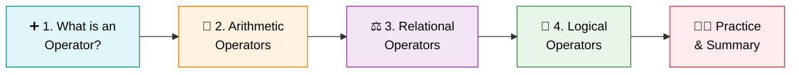
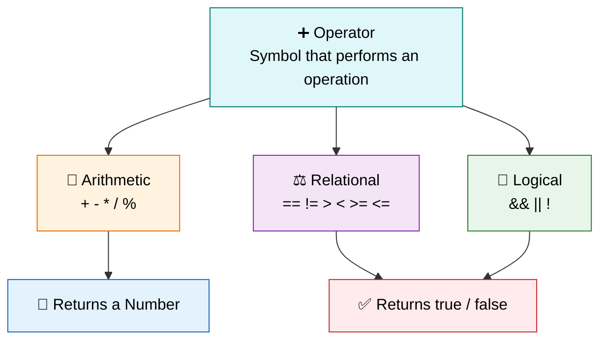

<div align="center">

# ➕ Level 7 — Operators
### *The Symbols That Power Every Calculation and Decision*


</div>

---

## 🎯 Goal of This Level

> 💬 **Learn how to perform calculations and compare values using operators.**

Operators are the tools that let your program **compute, compare, and decide**. ⚙️

---

## 🗺️ Your Learning Path



---

## ✅ Progress Tracker

- [ ] 1. What is an Operator?
- [ ] 2. Arithmetic Operators
- [ ] 3. Relational (Comparison) Operators
- [ ] 4. Logical Operators
- [ ] 🧑‍💻 Practice Exercises
- [ ] 📝 Level 7 Summary

---
---

# 1️⃣ What is an Operator? ➕

<blockquote>

### 📖 Simple Definition
An **Operator** is a symbol used to perform an operation on values or variables.

</blockquote>

### 💡 Suitable Example

> 🖩 Think of a **calculator**.
>
> When you press **+**, **-**, **×**, or **÷**, you are using operators.

<details>
<summary>🇮🇳 <b>படிக்க கிளிக் செய்யவும் — Simple Tamil Explanation</b></summary>

<br>

**Operator** என்பது இரண்டு Values அல்லது Variables மீது ஒரு Operation செய்ய பயன்படும் Symbol.

Calculator-ல் **+**, **-**, **×**, **÷** பயன்படுத்துவது போல Java-விலும் Operators பயன்படுத்தப்படுகின்றன.

</details>

> [!TIP]
> ### ⭐ Key Points to Remember
> - Operators perform operations.
> - Used for calculations and comparisons.
> - Makes programming easier.

<div align="right">

[⬆️ Back to Learning Path](#️-your-learning-path)

</div>

---

# 2️⃣ Arithmetic Operators 🧮

<blockquote>

### 📖 Simple Definition
Arithmetic Operators are used to perform mathematical calculations.

</blockquote>

### 💡 Suitable Example

> 🖩 Just like a calculator performs addition and subtraction.

### 📊 Operators

| Operator | Meaning | Example |
|:---:|:---|:---|
| `+` | Addition | `10 + 5 = 15` |
| `-` | Subtraction | `10 - 5 = 5` |
| `*` | Multiplication | `10 * 5 = 50` |
| `/` | Division | `10 / 5 = 2` |
| `%` | Modulus (Remainder) | `10 % 3 = 1` |

### 💻 Example

```java
int a = 10;
int b = 5;

System.out.println(a + b);
System.out.println(a - b);
System.out.println(a * b);
System.out.println(a / b);
System.out.println(a % b);
```

<details>
<summary>🇮🇳 <b>படிக்க கிளிக் செய்யவும் — Simple Tamil Explanation</b></summary>

<br>

Arithmetic Operators கணித கணக்குகள் செய்ய பயன்படும்.

- `+` → கூட்டல்
- `-` → கழித்தல்
- `*` → பெருக்கல்
- `/` → வகுத்தல்
- `%` → மீதி (Remainder)

</details>

> [!TIP]
> ### ⭐ Key Points to Remember
> - Used for mathematical calculations.
> - `%` gives the remainder.

<div align="right">

[⬆️ Back to Learning Path](#️-your-learning-path)

</div>

---

# 3️⃣ Relational (Comparison) Operators ⚖️

<blockquote>

### 📖 Simple Definition
Relational Operators compare two values and return **true** or **false**.

</blockquote>

### 💡 Suitable Example

> 📊 Comparing two students' marks.

### 📊 Operators

| Operator | Meaning |
|:---:|:---|
| `==` | Equal to |
| `!=` | Not Equal to |
| `>` | Greater Than |
| `<` | Less Than |
| `>=` | Greater Than or Equal |
| `<=` | Less Than or Equal |

### 💻 Example

```java
int age = 20;

System.out.println(age > 18);
System.out.println(age == 20);
```

**Output:**

```
true
true
```

<details>
<summary>🇮🇳 <b>படிக்க கிளிக் செய்யவும் — Simple Tamil Explanation</b></summary>

<br>

Relational Operators இரண்டு Values-ஐ Compare செய்து **true** அல்லது **false** கொடுக்கும்.

</details>

> [!TIP]
> ### ⭐ Key Points to Remember
> - Used for comparison.
> - Result is always **true** or **false**.

> [!WARNING]
> ### ⚠️ Common Mistake
> Don't confuse `=` (assignment) with `==` (comparison) — using a single `=` when you mean to compare is a classic beginner slip!

<div align="right">

[⬆️ Back to Learning Path](#️-your-learning-path)

</div>

---

# 4️⃣ Logical Operators 🔗

<blockquote>

### 📖 Simple Definition
Logical Operators combine multiple conditions.

</blockquote>

### 💡 Suitable Example

> 🎓 A student can write the exam only if:
> - Hall Ticket Available ✅
> - Fees Paid ✅
>
> **Both** conditions must be true.

### 📊 Operators

| Operator | Meaning |
|:---:|:---|
| `&&` | AND |
| `\|\|` | OR |
| `!` | NOT |

### 💻 Example

```java
boolean hasID = true;
boolean paidFees = true;

System.out.println(hasID && paidFees);
```

**Output:**

```
true
```

<details>
<summary>🇮🇳 <b>படிக்க கிளிக் செய்யவும் — Simple Tamil Explanation</b></summary>

<br>

Logical Operators பல Conditions-ஐ சேர்த்து Check செய்ய பயன்படும்.

</details>

> [!TIP]
> ### ⭐ Key Points to Remember
> - `&&` → Both conditions must be true.
> - `||` → Any one condition is true.
> - `!` → Opposite value.

<div align="right">

[⬆️ Back to Learning Path](#️-your-learning-path)

</div>

---

## 🔍 Quick Comparison — Operator Families

| Family | Symbols | Returns | Used For |
|:---|:---|:---|:---|
| 🧮 **Arithmetic** | `+ - * / %` | A number | Calculations |
| ⚖️ **Relational** | `== != > < >= <=` | `true` / `false` | Comparisons |
| 🔗 **Logical** | `&& \|\| !` | `true` / `false` | Combining conditions |

---
---

# 🧑‍💻 Practice Zone

> Let's put every operator family to work! 💪

<details>
<summary>🔓 <b>Practice 1 — Simple Calculator</b></summary>

<br>

```java
import java.util.Scanner;

public class Main {

    public static void main(String[] args) {

        Scanner sc = new Scanner(System.in);

        System.out.print("Enter First Number: ");
        int a = sc.nextInt();

        System.out.print("Enter Second Number: ");
        int b = sc.nextInt();

        System.out.println("Addition: " + (a + b));
        System.out.println("Subtraction: " + (a - b));
        System.out.println("Multiplication: " + (a * b));
        System.out.println("Division: " + (a / b));
        System.out.println("Remainder: " + (a % b));

        sc.close();
    }
}
```

</details>

<details>
<summary>🔓 <b>Practice 2 — Compare Ages</b></summary>

<br>

```java
import java.util.Scanner;

public class Main {

    public static void main(String[] args) {

        Scanner sc = new Scanner(System.in);

        System.out.print("Enter First Age: ");
        int age1 = sc.nextInt();

        System.out.print("Enter Second Age: ");
        int age2 = sc.nextInt();

        System.out.println("First Age is Greater: " + (age1 > age2));

        sc.close();
    }
}
```

</details>

<details>
<summary>🔓 <b>Practice 3 — Find Maximum</b></summary>

<br>

```java
import java.util.Scanner;

public class Main {

    public static void main(String[] args) {

        Scanner sc = new Scanner(System.in);

        System.out.print("Enter First Number: ");
        int a = sc.nextInt();

        System.out.print("Enter Second Number: ");
        int b = sc.nextInt();

        System.out.println("Maximum Value: " + Math.max(a, b));

        sc.close();
    }
}
```

</details>

<details>
<summary>🔓 <b>Practice 4 — Even or Odd</b></summary>

<br>

```java
import java.util.Scanner;

public class Main {

    public static void main(String[] args) {

        Scanner sc = new Scanner(System.in);

        System.out.print("Enter Number: ");
        int number = sc.nextInt();

        System.out.println("Is Even: " + (number % 2 == 0));

        sc.close();
    }
}
```

</details>

<details>
<summary>🔓 <b>Practice 5 — Percentage Calculation</b></summary>

<br>

```java
import java.util.Scanner;

public class Main {

    public static void main(String[] args) {

        Scanner sc = new Scanner(System.in);

        System.out.print("Enter Total Marks: ");
        double total = sc.nextDouble();

        System.out.print("Enter Obtained Marks: ");
        double obtained = sc.nextDouble();

        double percentage = (obtained / total) * 100;

        System.out.println("Percentage: " + percentage + "%");

        sc.close();
    }
}
```

</details>

---
---

<div align="center">

# 📝 Level 7 Summary

### 🏁 You can now calculate, compare, and combine conditions!

</div>

## 📖 What You Learned

<details open>
<summary><b>📚 Click to expand / collapse the full topic list</b></summary>

<br>

1. ✅ What is an Operator?
2. ✅ Arithmetic Operators
3. ✅ Relational Operators
4. ✅ Logical Operators

</details>

---

## ⭐ Final Key Points to Remember

> [!IMPORTANT]
>
> | # | Concept | Key Idea |
> |:---:|:---|:---|
> | 1️⃣ | **Operator** | Symbol that performs an operation |
> | 2️⃣ | **Arithmetic Operators** | Perform calculations |
> | 3️⃣ | **Relational Operators** | Compare values |
> | 4️⃣ | **Logical Operators** | Combine conditions |
> | 5️⃣ | **`%`** | Gives the remainder |
> | 6️⃣ | **Comparison Result** | Always returns **true** or **false** |
> | 7️⃣ | **Everywhere** | Operators are used in almost every Java program |

---

## 🔁 Quick Revision — The Big Picture



---

<div align="center">

> 🎉 **Congratulations!** You've completed **Level 7 — Operators**.
>
> You now know how to calculate, compare, and combine conditions in Java.
>
> ### ➡️ Ready for **Level 8**? Keep the streak going! 🚀

---

**📌 Level 7 · Operators · Beginner Track**

</div>
