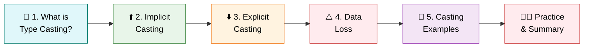
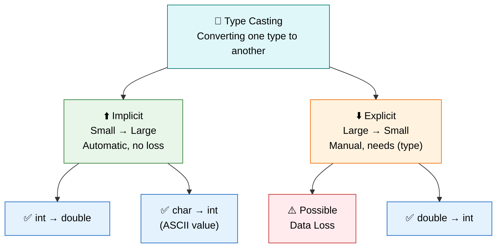

<div align="center">

# 🔄 Level 8 — Type Casting
### *Converting Data From One Type to Another*


</div>

---

## 🎯 Goal of This Level

> 💬 **Learn how to convert one data type into another.**

Sometimes data needs to change shape to fit where it's going — let's learn how Java handles that. 🧊➡️💧

---

## 🗺️ Your Learning Path



---

## ✅ Progress Tracker

- [ ] 1. What is Type Casting?
- [ ] 2. Implicit Casting (Widening)
- [ ] 3. Explicit Casting (Narrowing)
- [ ] 4. Data Loss
- [ ] 5. Casting Examples
- [ ] 🧑‍💻 Practice Exercises
- [ ] 📋 Quick Summary Table
- [ ] 📝 Level 8 Summary

---
---

# 1️⃣ What is Type Casting? 🔄

<blockquote>

### 📖 Simple Definition
**Type Casting** is the process of converting one data type into another.

</blockquote>

### 💡 Suitable Example

> 🍾 Think of pouring water from a **small bottle** into a **big bottle**, or from a **big bottle** into a **small bottle**.
>
> Similarly, data can be converted from one type to another.

<details>
<summary>🇮🇳 <b>படிக்க கிளிக் செய்யவும் — Simple Tamil Explanation</b></summary>

<br>

**Type Casting** என்பது ஒரு Data Type-ல் இருக்கும் Value-ஐ வேறு ஒரு Data Type-ஆக மாற்றுவது.

</details>

> [!TIP]
> ### ⭐ Key Points to Remember
> - Converts one data type to another.
> - Two types of casting:
>   - Implicit Casting
>   - Explicit Casting

<div align="right">

[⬆️ Back to Learning Path](#️-your-learning-path)

</div>

---

# 2️⃣ Implicit Casting (Widening) ⬆️

<blockquote>

### 📖 Simple Definition
**Implicit Casting** happens automatically when converting a **smaller data type** to a **larger data type**.

</blockquote>

### 💡 Suitable Example

> 🥛 Pouring water from a **small glass** into a **large bucket**.
> Nothing is lost.

```java
int number = 100;
double value = number;

System.out.println(value);
```

**Output:**

```
100.0
```

<details>
<summary>🇮🇳 <b>படிக்க கிளிக் செய்யவும் — Simple Tamil Explanation</b></summary>

<br>

சிறிய Data Type-லிருந்து பெரிய Data Type-க்கு மாற்றும்போது Java தானாகவே மாற்றிவிடும்.

இதற்கு நாம் எந்த Casting-மும் எழுத தேவையில்லை.

</details>

> [!TIP]
> ### ⭐ Key Points to Remember
> - Automatic conversion.
> - Small → Large.
> - No data loss.

<div align="right">

[⬆️ Back to Learning Path](#️-your-learning-path)

</div>

---

# 3️⃣ Explicit Casting (Narrowing) ⬇️

<blockquote>

### 📖 Simple Definition
**Explicit Casting** is done manually when converting a **larger data type** to a **smaller data type**.

</blockquote>

### 💡 Suitable Example

> 🪣 Pouring water from a **large bucket** into a **small glass**.
> Some water may overflow.

```java
double marks = 89.75;
int result = (int) marks;

System.out.println(result);
```

**Output:**

```
89
```

<details>
<summary>🇮🇳 <b>படிக்க கிளிக் செய்யவும் — Simple Tamil Explanation</b></summary>

<br>

பெரிய Data Type-லிருந்து சிறிய Data Type-க்கு மாற்றும்போது Java தானாக மாற்றாது.

நாமே `(int)` போன்ற Casting எழுத வேண்டும்.

</details>

> [!TIP]
> ### ⭐ Key Points to Remember
> - Manual conversion.
> - Large → Small.
> - Data may be lost.

<div align="right">

[⬆️ Back to Learning Path](#️-your-learning-path)

</div>

---

## 🔍 Quick Comparison — Implicit vs Explicit

| Aspect | ⬆️ Implicit (Widening) | ⬇️ Explicit (Narrowing) |
|:---|:---|:---|
| **Direction** | Small → Large | Large → Small |
| **Done By** | Java (automatic) | Programmer (manual) |
| **Syntax** | No special syntax | Needs `(type)` |
| **Data Loss** | ❌ No | ✅ Possible |

---

# 4️⃣ Data Loss ⚠️

<blockquote>

### 📖 Simple Definition
Data Loss happens when some part of the value is removed during casting.

</blockquote>

### 💡 Suitable Example

> 🍾 A **2-liter bottle** cannot fit into a **1-liter bottle** completely.
> Some water is lost.

```java
double price = 99.99;
int amount = (int) price;

System.out.println(amount);
```

**Output:**

```
99
```

<details>
<summary>🇮🇳 <b>படிக்க கிளிக் செய்யவும் — Simple Tamil Explanation</b></summary>

<br>

Decimal Value-ஐ `int`-ஆக மாற்றும்போது Decimal பகுதி நீக்கப்படும்.

இதையே **Data Loss** என்பார்கள்.

</details>

> [!TIP]
> ### ⭐ Key Points to Remember
> - Happens in Explicit Casting.
> - Decimal part is removed.
> - Precision may be lost.

> [!WARNING]
> ### ⚠️ Common Mistake
> Casting `double` to `int` doesn't round the number — it simply **cuts off** the decimal part. `99.99` becomes `99`, not `100`!

<div align="right">

[⬆️ Back to Learning Path](#️-your-learning-path)

</div>

---

# 5️⃣ Casting Examples 🧪

<blockquote>

Three real casting scenarios you'll use again and again.

</blockquote>

### 💡 Example 1 — int → double

```java
int age = 20;
double newAge = age;

System.out.println(newAge);
```

**Output:**

```
20.0
```

<details>
<summary>🇮🇳 <b>Tamil Explanation</b></summary>

<br>

`int`-லிருந்து `double`-க்கு Java தானாக மாற்றுகிறது.

</details>

---

### 💡 Example 2 — double → int

```java
double cgpa = 8.75;
int value = (int) cgpa;

System.out.println(value);
```

**Output:**

```
8
```

<details>
<summary>🇮🇳 <b>Tamil Explanation</b></summary>

<br>

Decimal Value-ன் `.75` பகுதி நீக்கப்பட்டு `8` மட்டும் இருக்கும்.

</details>

---

### 💡 Example 3 — char → int

```java
char letter = 'A';
int ascii = letter;

System.out.println(ascii);
```

**Output:**

```
65
```

<details>
<summary>🇮🇳 <b>Tamil Explanation</b></summary>

<br>

ஒவ்வொரு Character-க்கும் ஒரு Number இருக்கும்.

'A' → 65

இதையே **ASCII Value** என்பார்கள்.

</details>

> [!NOTE]
> ### 🧠 Good to Know
> Every character in Java has a hidden numeric value called its **ASCII value** — that's why `char → int` casting works!

<div align="right">

[⬆️ Back to Learning Path](#️-your-learning-path)

</div>

---
---

# 🧑‍💻 Practice Zone

> Try each of these casting scenarios yourself! 💪

<details>
<summary>🔓 <b>Practice 1 — int → double</b></summary>

<br>

```java
int number = 50;
double value = number;

System.out.println(value);
```

</details>

<details>
<summary>🔓 <b>Practice 2 — double → int</b></summary>

<br>

```java
double price = 199.99;
int amount = (int) price;

System.out.println(amount);
```

</details>

<details>
<summary>🔓 <b>Practice 3 — char → int</b></summary>

<br>

```java
char ch = 'B';
int ascii = ch;

System.out.println(ascii);
```

</details>

---
---

# 📋 Quick Summary Table

| Conversion | Casting Type | Automatic? | Data Loss? |
|:---|:---|:---:|:---:|
| `int → double` | Implicit | ✅ Yes | ❌ No |
| `double → int` | Explicit | ❌ No | ✅ Yes |
| `char → int` | Implicit | ✅ Yes | ❌ No |

---
---

<div align="center">

# 📝 Level 8 Summary

### 🏁 You can now convert data confidently between types!

</div>

## 📖 What You Learned

<details open>
<summary><b>📚 Click to expand / collapse the full topic list</b></summary>

<br>

1. ✅ What is Type Casting?
2. ✅ Implicit Casting
3. ✅ Explicit Casting
4. ✅ Data Loss
5. ✅ `int → double`
6. ✅ `double → int`
7. ✅ `char → int`

</details>

---

## ⭐ Final Key Points to Remember

> [!IMPORTANT]
>
> | # | Concept | Key Idea |
> |:---:|:---|:---|
> | 1️⃣ | **Type Casting** | Converting one data type to another |
> | 2️⃣ | **Implicit Casting** | Automatic (Small → Large) |
> | 3️⃣ | **Explicit Casting** | Manual (Large → Small) |
> | 4️⃣ | **Data Loss** | Can occur during Explicit Casting |
> | 5️⃣ | **int → double** | Happens automatically |
> | 6️⃣ | **double → int** | Removes the decimal part |
> | 7️⃣ | **char → int** | Gives the ASCII value of the character |

---

## 🔁 Quick Revision — The Big Picture



---

<div align="center">

> 🎉 **Congratulations!** You've completed **Level 8 — Type Casting**.
>
> You now understand how and when Java converts data between types.
>
> ### ➡️ Ready for **Level 9**? Keep leveling up! 🚀

---

**📌 Level 8 · Type Casting · Beginner Track**

</div>
