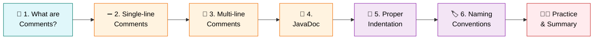
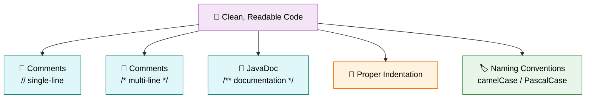

<div align="center">

# 🧹 Level 9 — Comments & Code Readability
### *Writing Code That Humans Can Understand Too*


</div>

---

## 🎯 Goal of This Level

> 💬 **Learn how to write clean, readable, and easy-to-understand Java code.**

Great code isn't just code that *works* — it's code that **other people (and future you) can read**. 📖

---

## 🗺️ Your Learning Path



---

## ✅ Progress Tracker

- [ ] 1. What are Comments?
- [ ] 2. Single-line Comments
- [ ] 3. Multi-line Comments
- [ ] 4. JavaDoc (Basic Introduction)
- [ ] 5. Proper Indentation
- [ ] 6. Naming Conventions
- [ ] 🧑‍💻 Practice Exercise
- [ ] 📋 Quick Summary Table
- [ ] 📝 Level 9 Summary

---
---

# 1️⃣ What are Comments? 💭

<blockquote>

### 📖 Simple Definition
**Comments** are notes written inside a program to explain the code. Java ignores comments during execution.

</blockquote>

### 💡 Suitable Example

> 📓 Think of writing notes in your **textbook** to understand a topic better.
>
> Similarly, comments help programmers understand the code.

<details>
<summary>🇮🇳 <b>படிக்க கிளிக் செய்யவும் — Simple Tamil Explanation</b></summary>

<br>

**Comments** என்பது Program-ல் எழுதப்படும் விளக்க குறிப்புகள் (Notes).

இதை Java Execute செய்யாது. இது Programmer-க்கு மட்டும் புரிய உதவும்.

</details>

> [!TIP]
> ### ⭐ Key Points to Remember
> - Used to explain code.
> - Java ignores comments.
> - Makes code easy to understand.

<div align="right">

[⬆️ Back to Learning Path](#️-your-learning-path)

</div>

---

# 2️⃣ Single-line Comments ➖

<blockquote>

### 📖 Simple Definition
A **Single-line Comment** is used to write a comment in one line.

</blockquote>

### 💡 Suitable Example

> 📝 A short note like:
> > Buy Milk

### Syntax

```java
// This is a comment
```

### Example

```java
// Print student name
System.out.println("Divakar");
```

<details>
<summary>🇮🇳 <b>படிக்க கிளிக் செய்யவும் — Simple Tamil Explanation</b></summary>

<br>

ஒரு வரியில் மட்டும் Comment எழுத வேண்டுமெனில் `//` பயன்படுத்த வேண்டும்.

</details>

> [!TIP]
> ### ⭐ Key Points to Remember
> - Starts with `//`
> - Used for short explanations.

<div align="right">

[⬆️ Back to Learning Path](#️-your-learning-path)

</div>

---

# 3️⃣ Multi-line Comments 📄

<blockquote>

### 📖 Simple Definition
A **Multi-line Comment** is used to write comments in multiple lines.

</blockquote>

### 💡 Suitable Example

> 📖 Writing a **paragraph** in your notebook.

### Syntax

```java
/*
   This is
   a multi-line
   comment
*/
```

### Example

```java
/*
Program:
Student Details

Author:
Divakar
*/
```

<details>
<summary>🇮🇳 <b>படிக்க கிளிக் செய்யவும் — Simple Tamil Explanation</b></summary>

<br>

பல வரிகளில் Comment எழுத `/* */` பயன்படுத்தப்படுகிறது.

</details>

> [!TIP]
> ### ⭐ Key Points to Remember
> - Starts with `/*`
> - Ends with `*/`
> - Used for long explanations.

<div align="right">

[⬆️ Back to Learning Path](#️-your-learning-path)

</div>

---

# 4️⃣ JavaDoc (Basic Introduction) 📘

<blockquote>

### 📖 Simple Definition
**JavaDoc** is a special type of comment used to describe classes and methods.

</blockquote>

### 💡 Suitable Example

> 📚 Like the **description page** at the beginning of a book.

### Syntax

```java
/**
 * Student Program
 * Displays student details.
 */
```

<details>
<summary>🇮🇳 <b>படிக்க கிளிக் செய்யவும் — Simple Tamil Explanation</b></summary>

<br>

**JavaDoc** என்பது Class அல்லது Method பற்றி தகவல் எழுத பயன்படும் Special Comment.

</details>

> [!TIP]
> ### ⭐ Key Points to Remember
> - Starts with `/**`
> - Used for documentation.
> - Mostly used in real projects.

<div align="right">

[⬆️ Back to Learning Path](#️-your-learning-path)

</div>

---

## 🔍 Quick Comparison — Comment Types

| Type | Syntax | Best For |
|:---|:---:|:---|
| ➖ **Single-line** | `//` | Quick, one-line notes |
| 📄 **Multi-line** | `/* */` | Longer explanations |
| 📘 **JavaDoc** | `/** */` | Official documentation |

---

# 5️⃣ Proper Indentation 📐

<blockquote>

### 📖 Simple Definition
**Indentation** means giving proper spaces to make code neat and readable.

</blockquote>

### 💡 Suitable Example

> 📓 A **neatly written notebook** is easier to read than a messy one.

### ✅ Good

```java
public class Main {

    public static void main(String[] args) {

        System.out.println("Hello");

    }
}
```

### ❌ Bad

```java
public class Main{
public static void main(String[] args){
System.out.println("Hello");
}
}
```

<details>
<summary>🇮🇳 <b>படிக்க கிளிக் செய்யவும் — Simple Tamil Explanation</b></summary>

<br>

Code-ஐ அழகாகவும் படிக்க எளிதாகவும் எழுதுவதையே **Indentation** என்பார்கள்.

</details>

> [!TIP]
> ### ⭐ Key Points to Remember
> - Makes code readable.
> - Makes debugging easier.
> - Good programming practice.

<div align="right">

[⬆️ Back to Learning Path](#️-your-learning-path)

</div>

---

# 6️⃣ Naming Conventions 🏷️

<blockquote>

### 📖 Simple Definition
Naming conventions are standard rules for naming variables, classes, and methods.

</blockquote>

### 💡 Suitable Example

> 🧑‍🤝‍🧑 Giving **meaningful names** to people instead of random numbers.

### 🔤 Variable

```java
studentName
mobileNumber
totalMarks
```

### 🏛️ Class

```java
Student
Employee
Calculator
```

### ⚙️ Method

```java
calculateTotal()
printDetails()
```

<details>
<summary>🇮🇳 <b>படிக்க கிளிக் செய்யவும் — Simple Tamil Explanation</b></summary>

<br>

Variable, Class, Method ஆகியவற்றிற்கு அர்த்தமுள்ள (Meaningful) பெயர்கள் வைக்க வேண்டும்.

</details>

> [!TIP]
> ### ⭐ Key Points to Remember
> - Use meaningful names.
> - Variable → camelCase
> - Class → PascalCase
> - Method → camelCase

| Element | Convention | Example |
|:---|:---:|:---|
| Variable | camelCase | `studentName` |
| Class | PascalCase | `Student` |
| Method | camelCase | `calculateTotal()` |

<div align="right">

[⬆️ Back to Learning Path](#️-your-learning-path)

</div>

---
---

# 🧑‍💻 Practice Zone

> Let's see everything working together in one clean, commented program! 💪

<details open>
<summary>🔓 <b>Practice — Comment an Entire Program</b></summary>

<br>

```java
// Student Information Program

public class Main {

    public static void main(String[] args) {

        // Store student details
        String name = "Divakar";
        int age = 20;
        String college = "ABC Engineering College";

        // Display student details
        System.out.println("Name : " + name);
        System.out.println("Age : " + age);
        System.out.println("College : " + college);
    }
}
```

</details>

---
---

# 📋 Quick Summary Table

| Comment Type | Syntax | Purpose |
|:---|:---:|:---|
| Single-line | `//` | One-line explanation |
| Multi-line | `/* */` | Multiple-line explanation |
| JavaDoc | `/** */` | Documentation for classes and methods |

---
---

<div align="center">

# 📝 Level 9 Summary

### 🏁 Your code is now clean, commented, and readable!

</div>

## 📖 What You Learned

<details open>
<summary><b>📚 Click to expand / collapse the full topic list</b></summary>

<br>

1. ✅ What are Comments?
2. ✅ Single-line Comments
3. ✅ Multi-line Comments
4. ✅ JavaDoc (Basic Introduction)
5. ✅ Proper Indentation
6. ✅ Naming Conventions

</details>

---

## ⭐ Final Key Points to Remember

> [!IMPORTANT]
>
> | # | Concept | Key Idea |
> |:---:|:---|:---|
> | 1️⃣ | **Comments** | Explain the code |
> | 2️⃣ | **Execution** | Java ignores comments during execution |
> | 3️⃣ | **`//`** | Single-line comment |
> | 4️⃣ | **`/* */`** | Multi-line comment |
> | 5️⃣ | **`/** */`** | JavaDoc comment |
> | 6️⃣ | **Indentation** | Makes code clean and readable |
> | 7️⃣ | **Naming** | Use meaningful names for variables, classes, and methods |
> | 8️⃣ | **Clean Code** | Easier to read, understand, and maintain |

---

## 🔁 Quick Revision — The Big Picture



---

<div align="center">

> 🎉 **Congratulations!** You've completed **Level 9 — Comments & Code Readability**.
>
> Your code is now something anyone can pick up and understand — including future you!
>
> ### ➡️ Ready for **Level 10**? Keep the momentum going! 🚀

---

**📌 Level 9 · Comments & Code Readability · Beginner Track**

</div>
